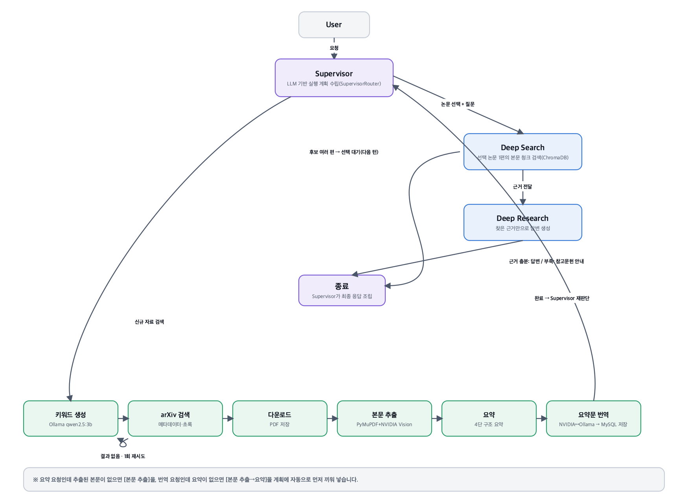
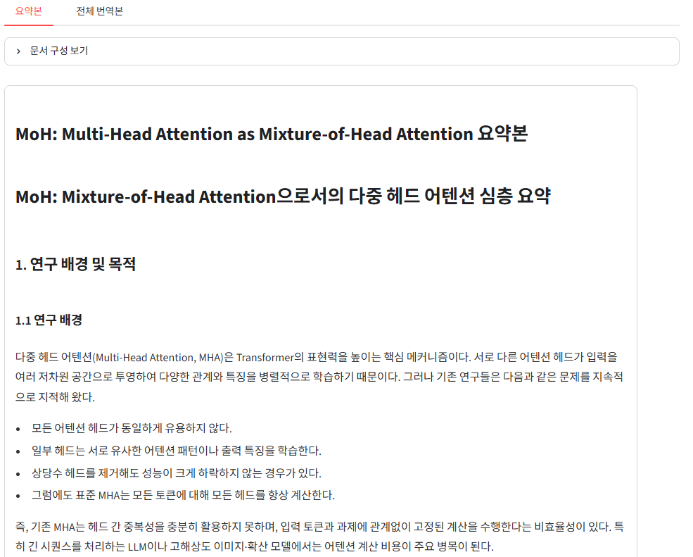

# Paper Scholar — Academic Paper RAG Chatbot (4th Team Project)

arXiv와 PDF 학술 논문을 수집·파싱·인덱싱하여 논문 검색, 번역, 요약 및 근거 기반 심층 질의응답을 제공하는 RAG(Retrieval-Augmented Generation) 챗봇 서비스입니다. 3차 프로젝트의 CLI·Streamlit·로컬 LangGraph 엔진을 그대로 재사용하면서, React 웹 프론트엔드와 Django REST API·MySQL 기반의 로그인 다중 사용자 웹 서비스로 확장했습니다.

## 목차

- [팀원 및 역할](#팀원-및-역할)
- [프로젝트 목표와 사용자 요구사항](#프로젝트-목표와-사용자-요구사항)
- [차별화 포인트](#차별화-포인트)
- [주요 기능](#주요-기능)
- [기술 스택](#기술-스택)
- [프로젝트 구조](#프로젝트-구조)
- [시스템 아키텍처](#시스템-아키텍처)
- [데이터 구조와 ERD](#데이터-구조와-erd)
- [API 설계](#api-설계)
- [Supervisor (자연어 실행 계획)](#supervisor-자연어-실행-계획)
- [스크린샷](#스크린샷)
- [실행 방법](#실행-방법)
  - [1. 환경변수 설정](#1-환경변수-설정)
  - [2. 백엔드(Django) 실행](#2-백엔드django-실행)
  - [3. 프론트엔드(React) 실행](#3-프론트엔드react-실행)
  - [4. Ollama 설치 및 실행 (로컬 폴백용)](#4-ollama-설치-및-실행-로컬-폴백용)
  - [5. Docker로 통합 실행](#5-docker로-통합-실행)
  - [6. 배포](#6-배포)
- [평가(Evaluation)](#평가evaluation)
- [Git & GitHub 협업 규칙](#git--github-협업-규칙)
  - [권장 작업 흐름](#권장-작업-흐름)
  - [1. 브랜치 규칙](#1-브랜치-규칙)
  - [2. 커밋 메시지 규칙](#2-커밋-메시지-규칙)
  - [3. Pull Request 및 병합 규칙](#3-pull-request-및-병합-규칙)
  - [4. 프로젝트 구조 및 데이터 관리](#4-프로젝트-구조-및-데이터-관리)
- [절대 금지 사항 (Don'ts)](#절대-금지-사항-donts)
- [사용 패키지](#사용-패키지)
- [데이터 출처](#데이터-출처)
- [AI 에이전트 작업 제약 사항](#ai-에이전트-작업-제약-사항)
- [알려진 제약 사항 (Known Limitations)](#알려진-제약-사항-known-limitations)
- [향후 개선 사항](#향후-개선-사항)
- [회고](#회고)

## 팀원 및 역할

| 팀원 | 담당 역할 | 주요 담당 기능 |
| --- | --- | --- |
| 박기현 | 팀장·통합 | 기능 통합, LangGraph 연결 보완 및 수정, 발표 자료 제작 |
| 오호민 | PM·인프라 | AWS·Docker 배포 및 자동화 |
| 김영석 | 논문 처리 | 논문 추출, 요약 Agent·번역 Agent 개발 |
| 정현두 | 백엔드 | DB 설계, Django 웹 서비스 개발, CI/CD 자동화 |
| 김성훈 | RAG 질의응답 | Deep Search, Deep Research, 출처 반환 |

## 프로젝트 목표와 사용자 요구사항

- **사용자 문제:** 논문 탐색, PDF 읽기, 번역·요약, 근거 확인이 여러 도구에 흩어져 있어 시간이 오래 걸립니다.
- **목표:** 사용자가 선택한 논문만 처리해 비용을 줄이고, 답변과 근거 문장을 함께 제공합니다.
- **기능 요구사항:** 회원가입·로그인(JWT), arXiv 검색·서재 저장, 본문 추출, 요약·번역, 근거 기반 Q&A, Supervisor 자연어 실행 계획.
- **비용 최소화:** 상시 GPU 서버 대신 로컬 Ollama·CPU 임베딩과 NVIDIA Build API·Gemini·OpenAI API를 조합해 고정 인프라 비용을 최소화합니다.
- **선택적 논문 처리:** 검색 결과의 초록을 먼저 확인한 뒤 사용자가 선택한 논문만 다운로드하고 인덱싱합니다.
- **신뢰도 높은 답변:** Deep Search가 찾은 본문 근거를 바탕으로 답변해 환각을 줄입니다.
- **다중 사용자 지원:** JWT 인증과 사용자별 서재(`LibraryEntry`)로 여러 사용자가 동시에 이용할 수 있는 웹 서비스로 확장합니다.

## 차별화 포인트

Elicit·SciSpace류 논문 리서치 도구와 비교해 설계에서 특히 신경 쓴 지점입니다.

1. **근거 문장 반환:** Deep Search가 찾은 논문 본문 청크를 답변과 함께 반환해 인용 출처를 명확히 제시합니다.
2. **Supervisor 선택형 실행:** 고정된 전체 파이프라인 대신, 자연어 요청을 분석해 필요한 작업(검색·저장·추출·요약·번역)만 계획합니다.
3. **사용자별 서재 격리:** `LibraryEntry`가 `(user, paper)` 조합에 유니크 제약을 둬 사용자별 서재를 완전히 분리합니다.
4. **비용 최소화:** 상시 GPU 서버 대신 로컬 Ollama와 NVIDIA Build API·Gemini·OpenAI API 조합으로 고정 비용을 낮춥니다.

## 주요 기능

1. 회원가입·로그인(JWT) 후 arXiv API로 논문 메타데이터·초록 검색
2. 검색 결과를 사용자별 서재에 저장하고, 선택한 논문만 다운로드 및 하이브리드(로컬 파싱 + NVIDIA Vision) PDF 파싱
3. 본문 4단 구조 요약(NVIDIA Build API → 과부하 시 로컬 Ollama로 폴백) 후 한국어 요약문 번역, MySQL 저장
4. Deep Search가 선택한 논문 1편의 본문 청크(ChromaDB)에서 근거를 찾고, Deep Research가 그 근거만으로 답변 생성
5. 자연어 요청("논문 찾아서 요약해줘" 등)을 실행 계획으로 바꿔주는 Supervisor(`/api/supervisor/plan`)
6. React 웹 UI 하나로 검색·서재·논문 상세(본문·요약·번역·Q&A)를 제공

## 기술 스택

| 구분 | 기술 |
| --- | --- |
| Frontend | React 19, Vite, KaTeX(수식 렌더링) |
| Backend | Django 5.2, Django REST Framework, Simple JWT, MySQL(PyMySQL) |
| AI 엔진 (재사용) | Python, LangGraph, LangChain — `src/tools`·`src/services`를 Django에서 그대로 import |
| Keyword / Summary LLM | Ollama(`qwen2.5:3b`), NVIDIA Build API(`nemotron-3-nano-omni`), Gemini(대체 provider) |
| Translation | NVIDIA Build API, 과부하 시 로컬 Ollama로 폴백 |
| Supervisor 라우팅 | OpenAI(`gpt-5.6-luna`) 구조화 출력 |
| 별도 LLM 서빙 | FastAPI(`main.py`) — RunPod에 배포, Cloudflare Tunnel(`RUNPOD_API_URL`)로 접근 |
| Embedding / Vector DB | Hugging Face `BAAI/bge-m3`, ChromaDB (Deep Search 본문 청크·요약 임베딩) |
| Infra | Docker, nginx, `deploy.sh`(AWS EC2 배포 스크립트), 외부 MySQL(자체 호스팅) |
| Evaluation | LangSmith, RAGAS 기반 corpus_v4(Deep Search Q&A 200건) + corpus_v3(파이프라인 전반 400건) |
| Architecture | RAG, Human-in-the-Loop, Multi-Agent, JWT 기반 다중 사용자 |

> 기술 스택은 구현 및 검증 과정에서 변경될 수 있습니다.

## 프로젝트 구조

```text
Paper_Scholar/
├── .env.sample                     # 환경변수 예시 파일
├── .gitignore
├── Dockerfile                      # Django 백엔드 컨테이너 이미지
├── deploy.sh                       # AWS EC2 배포 스크립트 (git pull → docker build → migrate → 프론트 빌드)
├── main.py                         # RunPod에 배포되는 별도 FastAPI 서비스 (arXiv 검색 프록시, LLM 추론 엔드포인트)
├── manage.py                       # backend/manage.py로 위임하는 저장소 루트 진입점
├── requirements.txt                # Django·LangGraph·FastAPI 등 전체 Python 의존성
├── backend/                        # Django 프로젝트
│   ├── manage.py
│   ├── django_config/              # 설정, URL 라우팅 (src/를 import 경로에 등록)
│   │   ├── settings.py
│   │   ├── urls.py
│   │   └── wsgi.py / asgi.py
│   └── scholar/                    # 메인 Django 앱
│       ├── models.py                # Paper·LibraryEntry·PaperSection·PaperSummary·Translation·ProcessingJob·SupervisorRun
│       ├── views.py                 # 검색·서재·본문·요약·번역·Q&A API
│       ├── serializers.py
│       ├── urls.py                  # /api/* 엔드포인트 정의
│       ├── supervisor_service.py    # 자연어 → 실행 계획 변환(SupervisorPlanner)
│       ├── supervisor_views.py      # /api/supervisor/plan
│       ├── jobs.py                  # 비동기 ProcessingJob 실행
│       └── services/                # summary_service·translation_service·rag_service (src/tools 재사용)
├── frontend/                       # React + Vite 웹 UI
│   ├── package.json
│   └── src/
│       ├── App.jsx
│       ├── AuthContext.jsx / AuthPage.jsx     # 로그인·회원가입
│       ├── SearchPanel.jsx                    # arXiv 검색·서재 저장
│       ├── PaperDetail.jsx                    # 본문·요약·번역·Q&A
│       ├── PaperChat.jsx / SupervisorChat.jsx # 근거 기반 Q&A, Supervisor 대화
│       └── api.js                             # Django REST API 클라이언트
├── src/                             # 3차 프로젝트의 LangGraph AI 엔진 (Django·CLI 공용)
│   ├── config/model_config.yaml
│   ├── feature/                     # supervisor_chatbot, search, search_list, paper_extractor, deep_research
│   ├── orchestration/               # state, routing, graph(StateGraph), adapters, evaluation
│   ├── services/                    # 모델 호출, 체크포인트, Markdown·Vector DB 저장
│   └── tools/                       # keyword_tool, translation_tool_v2, summary_tool_v2, deep_search_tool
├── evaluation/                     # LangSmith·RAGAS 평가 스크립트
│   ├── README.md
│   ├── corpus_v3/                   # 파이프라인 전반 평가 코퍼스 (40편, 후보 문항 650건)
│   ├── corpus_v4/                   # Deep Search Q&A 평가 코퍼스 (200건, RAGAS 지표)
│   ├── run_v3_evaluation.py / run_v4_evaluation.py
│   ├── evaluation_v4_metrics.py     # answer relevancy·page recall·MRR (v4 신규 지표)
│   ├── generate_v4_questions.py / v4_runtime.py
│   └── requirements.txt
├── data/                           # 논문 메타데이터·본문·번역·요약·figures 저장 위치
│   └── figures/                     # README용 아키텍처 다이어그램·화면 캡처
├── nginx/                          # 프론트엔드 정적 파일 서빙 설정
├── config/                         # 배포·런타임 설정 파일
├── log/                            # 공통 로거
└── tests/                          # 기능·오케스트레이션 자동화 테스트
```

## 시스템 아키텍처

Supervisor(자연어 실행 계획)가 요청을 분석해 필요한 작업만 계획하고, 실제 처리는 Django REST API가 `src/tools`의 기존 LangGraph 엔진을 그대로 호출해 수행하는 구조입니다.



### 핵심 분기 규칙

- **신규 자료 검색:** `키워드 생성` → `arXiv 검색` → `다운로드` → `본문 추출` → `요약` → `요약문 번역` 순으로 필요한 단계만 실행됩니다.
- **검색 결과 없음:** `arXiv 검색` 결과가 비어 있으면 이전과 다른 키워드로 최대 1회 재생성·재시도 후, 그래도 없으면 종료합니다.
- **선행 산출물 자동 보강:** 요약 요청인데 추출된 본문이 없으면 `본문 추출`을, 번역 요청인데 요약이 없으면 `본문 추출 → 요약`을 계획에 자동으로 먼저 끼워 넣습니다.
- **근거 기반 질의응답(Deep Search → Deep Research):** 사용자가 논문 한 편을 선택하면 Deep Search가 그 논문의 본문 청크(ChromaDB)에서 근거를 검색하고, Deep Research가 그 근거만으로 답변합니다. 근거가 없으면 답변 대신 해당 논문의 참고문헌을 안내합니다.
- **모델 폴백:** 요약·번역은 NVIDIA Build API를 우선 사용하고, 과부하(429/5xx) 응답을 받으면 로컬 Ollama(`qwen2.5:3b`)로 자동 전환합니다.

## 데이터 구조와 ERD

논문 산출물은 재사용하고, `LibraryEntry`로 사용자별 서재만 분리하는 원칙으로 설계했습니다 (`backend/scholar/models.py`).

| 테이블 | 역할 |
| --- | --- |
| `Paper` | arXiv 메타데이터, PDF 경로, 다운로드 상태 (`arxiv_id` UNIQUE) |
| `LibraryEntry` | 사용자별 서재 저장 (`user`+`paper` UNIQUE, 중복 저장 방지) |
| `PaperSection` | PDF에서 추출한 본문을 절 순서대로 저장 |
| `PaperSummary` | 논문당 최종 요약 1건 (재요약 시 갱신) |
| `Translation` | 요약문/본문 번역 (`translation_type`: summary/full_text) |
| `ProcessingJob` | 다운로드·추출·요약·번역 작업의 진행 상태와 오류 기록 |
| `SupervisorRun` | Supervisor 자연어 실행 1건의 계획(`plan`)·진행 상태(`node_history`)·응답을 기록 |

## API 설계

API는 화면(React) 담당자와 AI 기능 담당자가 독립적으로 작업할 수 있게 하는 계약 역할을 합니다 (`backend/scholar/urls.py`).

| 그룹 | 엔드포인트 |
| --- | --- |
| 상태 확인 & 인증 | `health`, `auth/register`, `auth/token`, `auth/token/refresh`, `auth/me` |
| 논문 검색 & 서재 | `search`, `papers`, `papers/save`, `jobs/<id>` |
| 본문 · 요약 · 번역 | `papers/<id>/sections`, `papers/<id>/extract`, `papers/<id>/summary`, `papers/<id>/summarize`, `papers/<id>/translations`, `papers/<id>/translate` |
| 논문 Q&A & Supervisor | `papers/<id>/ask`, `supervisor/plan` |

## Supervisor (자연어 실행 계획)

웹 버전의 Supervisor(`backend/scholar/supervisor_service.py`)는 자연어 요청을 검증된 실행 계획(`SupervisorPlan`: search/save/extract/summarize/translate 액션 목록)으로 변환하는 경량 플래너입니다. 계획 자체는 논문 작업을 수행하지 않고, React 프론트엔드가 이 계획을 순서대로 각 API에 호출해 실행합니다.

> 참고: `src/orchestration/graph.py`에는 3차 프로젝트에서 만든 9개 노드짜리 전체 LangGraph StateGraph(순환 그래프)도 그대로 남아 있어, 필요 시 CLI 등에서 독립적으로 재사용할 수 있습니다.

## 스크린샷

> 아래 이미지는 3차 프로젝트 당시 캡처로, 현재 React 웹 화면과 다를 수 있습니다. 최신 화면 캡처로 교체가 필요합니다.





## 실행 방법

### 1. 환경변수 설정

저장소를 내려받은 뒤 `.env.sample` 파일을 복사하여 `.env` 파일을 생성합니다.

```bash
cp .env.sample .env
```

`.env.sample`에는 다음 값들이 정의되어 있습니다. 각 값을 본인의 키·접속 정보로 변경합니다.

```dotenv
OPENAI_API_KEY=your_openai_api_key
OPENAI_CHAT_MODEL=gpt-5.6-luna
NVIDIA_API_KEY=your_nvidia_build_key
GEMINI_API_KEY=your_gemini_api_key
LANGSMITH_API_KEY=your_langsmith_api_key

DJANGO_SECRET_KEY=...
CORS_ALLOWED_ORIGINS=http://localhost:5173,...

DB_NAME=paper_scholar
DB_USER=paper_scholar_app
DB_PASSWORD=your_password_here
DB_HOST=skn33.iptime.org
DB_PORT=33062

RUNPOD_API_URL=https://llm.skn33-project.store
```

> 실제 API 키, 비밀번호 등 민감한 정보는 `.env.sample`이나 소스코드에 작성하지 않습니다.

### 2. 백엔드(Django) 실행

프로젝트 루트에서 기본 의존성을 설치합니다.

```bash
python3 -m venv .venv
source .venv/bin/activate
pip install --upgrade pip
pip install -r requirements.txt
```

DB 마이그레이션 후 서버를 실행합니다 (루트 `manage.py`가 `backend/`로 위임합니다).

```bash
python manage.py migrate
python manage.py runserver 0.0.0.0:8000
```

### 3. 프론트엔드(React) 실행

```bash
cd frontend
npm install
npm run dev
```

기본적으로 `VITE_API_BASE_URL`(미설정 시 `/api`)로 백엔드에 요청합니다. 로컬 개발 시 `frontend/.env.development`에서 백엔드 주소를 맞춰줍니다.

### 4. Ollama 설치 및 실행 (로컬 폴백용)

NVIDIA Build API가 과부하이거나 로컬 개발 시 요약·키워드 생성은 Ollama로 폴백합니다.

```bash
curl -fsSL https://ollama.com/install.sh | sh   # macOS
ollama serve
ollama pull qwen2.5:3b
```

Windows는 [Ollama 공식 문서](https://docs.ollama.com/windows)를 참고합니다.

### 5. Docker로 통합 실행

```bash
docker build -t paper-scholar .
docker run -d --name paper-scholar -p 8000:8000 paper-scholar
docker exec paper-scholar python manage.py migrate
```

Docker 이미지는 Django 백엔드만 포함합니다. React 빌드 결과(`frontend/dist`)는 nginx가 정적 파일로 서빙합니다.

### 6. 배포

`deploy.sh`는 AWS EC2에서 다음 순서로 배포합니다: `git pull origin main` → `docker build`(캐시 활용) → 기존 컨테이너 교체 → `python manage.py migrate` → 프론트엔드 `npm run build` → nginx가 `/var/www/paper-scholar`를 서빙. MySQL은 자체 호스팅 서버(`skn33.iptime.org`)를 사용하며, LLM 추론은 별도로 RunPod에 배포한 FastAPI(`main.py`)를 Cloudflare Tunnel로 연결해 사용합니다.

## 평가(Evaluation)

평가 코퍼스는 두 버전이 있습니다. `corpus_v4`가 현재 웹 서비스(Deep Search Q&A)를 직접 대상으로 하는 최신 평가이고, `corpus_v3`는 이전 파이프라인 전반(400건)을 다루는 평가입니다. 자세한 실행 방법은 [`evaluation/README.md`](evaluation/README.md)를 참고합니다.

### corpus_v4 — Deep Search Q&A 평가 (200건, RAGAS 지표)

```bash
python -m evaluation.run_v4_evaluation --questions evaluation/corpus_v4/generated/questions_v4.jsonl
```

`evaluation/run_v4_evaluation.py`는 "src/backend/frontend를 읽기 전용으로만 사용"하며, 격리된 `evaluation/corpus_v4` SQLite DB를 대상으로 실행됩니다. 결과는 `evaluation/corpus_v4/generated/evaluation_summary_v4.json`에 저장됩니다.

| 지표 | 전체 평균 | 표본 수 |
| --- | ---: | ---: |
| Faithfulness (답변 충실성) | 0.7859 | 142 |
| Answer Relevancy (관련성) | 0.6320 | 200 |
| Page Recall@K (검색 재현율) | 0.4500 | 200 |
| Page Reciprocal Rank (MRR) | 0.2885 | 200 |
| Citation Precision (출처 정밀도) | 0.0000 | 142 |

실행 오류 0건, 총 200케이스. 주제별(딥러닝·LLM·머신러닝·RAG·Transformer) 세부 지표는 `evaluation_summary_v4.json`의 `by_topic`에서 확인할 수 있습니다. Faithfulness는 Transformer·딥러닝 주제에서 가장 높고(0.81~0.88), RAG 주제에서 가장 낮았습니다(0.70). Citation Precision이 모든 주제에서 0.0으로 측정되어, 답변에 명시적 출처(`[S1]` 등) 표기를 강화해야 한다는 과제가 v3에 이어 v4에서도 재확인됐습니다.

### corpus_v3 — 파이프라인 전반 평가 (400건)

```bash
python -m evaluation.run_v3_evaluation --suite all --answer-mode openai --budget 400
```

후보 문항 650건 중 400건을 고정 예산으로 실행했습니다.

| 평가 Suite | 후보 문항 | 실제 실행 |
| --- | ---: | ---: |
| Artifacts | 40 | 40 |
| Retrieval | 400 | 240 |
| Deep Research | 80 | 40 |
| Pipeline | 80 | 40 |
| Refusal | 50 | 40 |
| 합계 | 650 | 400 |

| 평가 항목 | 결과 | 해석 |
| --- | ---: | --- |
| 실행/오류 건수 | 400건 / 0건 | 고정 평가 예산, 실행 오류 없음 |
| 논문 단위 검색 Recall@K / MRR | 1.0000 / 1.0000 | 정답 논문 ID가 고정된 조건의 영향 |
| Passage Section Recall@5 / MRR | 0.4042 / 0.3979 | 본문 구간 검색 성능 (실제 품질은 이 지표를 중심으로 해석) |
| 인용 정밀도 | 0.0000 | 명시적 출처 표기 부족 |
| 거절 정확도 | 0.7000 | 범위 밖 질문의 안전한 거절 |
| 필수 용어 재현율 | 0.5000 | Deep Research 핵심 용어 보존 |
| LangGraph 경로 정확도 / Pipeline 완료율 | 1.0000 / 1.0000 | 예상 경로 일치, 파이프라인 완료 여부 |

> 논문 단위 Recall@K·MRR 1.0은 평가 구조상 정답 논문 ID가 고정된 영향이며, 실제 검색 품질은 Passage Section 지표(v3)와 Page Recall/MRR(v4)을 중심으로 해석해야 합니다.

RAGAS Faithfulness/Answer Relevancy는 v4에서 정식으로 측정됐고, LLM-as-a-Judge 등 추가 평가는 별도 API 토큰이 설정된 환경에서 실행합니다. 원본 PDF와 대용량 평가 산출물(SQLite DB, `source_pdfs/`)은 용량 때문에 GitHub에 커밋하지 않습니다.

---

# Git & GitHub 협업 규칙

## 권장 작업 흐름

> **최신 `main` 확인 → 브랜치 생성 → 작업 및 커밋 → `main` 동기화 및 충돌 해결 → Push → PR 생성 → 코드 리뷰 → Squash Merge → 브랜치 삭제**

## 1. 브랜치 규칙

- **브랜치 생성:** 항상 최신 `main` 브랜치에서 생성합니다.
- **네이밍 규칙:** `작업종류/이니셜/작업명`
  - 예시: `feat/PKH/evaluation-corpus-v4`
  - 작업명은 영문 소문자와 하이픈(`-`)만 사용합니다.
- **작업 단위:** `1 브랜치 = 1 목적` 원칙을 지킵니다.
- **사후 관리:** Merge가 완료된 브랜치는 로컬과 원격에서 모두 삭제합니다.

## 2. 커밋 메시지 규칙

- **메시지 형식:** `[이니셜] 타입: 변경 내용`
  - 예시: `[PKH] feat: RunPod Ollama 원격 엔드포인트 연동`
- **작성 원칙:**
  - 변경 내용을 구체적으로 명시하고 끝에는 마침표를 붙이지 않습니다.
  - `수정`, `작업` 등 의미가 모호한 단어만으로 작성하지 않습니다.
  - 전체 파일 추가(`git add .`) 대신 변경된 파일을 확인하여 선택적으로 추가하고 커밋합니다.

### 주요 타입(Type)

| 타입 | 설명 |
| --- | --- |
| `feat` | 새로운 기능 추가 |
| `fix` | 버그 및 오류 수정 |
| `docs` | 문서 변경 |
| `refactor` | 기능 변경 없는 코드 구조 개선 |
| `test` | 테스트 코드 추가 및 수정 |
| `chore` | 환경 설정, 패키지 및 기타 작업 |
| `style` | 화면 디자인(UI) 및 스타일 변경 |
| `deploy` | 배포·인프라 관련 작업 |

## 3. Pull Request 및 병합 규칙

- **PR 대상:** 항상 `main` 브랜치를 대상으로 PR을 생성합니다.
- **사전 작업:** PR 생성 전에 원격 `main`의 최신 변경 사항을 작업 브랜치에 반영하고 충돌을 해결합니다.
- **PR 내용:** 작업 목적, 주요 변경 사항, 실행 방법 및 테스트 결과를 상세히 작성합니다.
- **미완성 작업:** 아직 완료되지 않은 작업은 Draft PR을 활용합니다.
- **Merge 조건:**
  - 최소 1명 이상의 팀원 리뷰와 승인이 필요합니다.
  - 본인의 PR을 직접 병합하는 Self-merge는 금지합니다.
- **Merge 방식:** `Squash and merge`로 통일합니다.

## 4. 프로젝트 구조 및 데이터 관리

### 디렉터리 구조

- 새로운 디렉터리가 필요하면 팀원과 먼저 논의한 후 추가합니다.
- AI 처리 로직은 `src/`(재사용 엔진), 웹 API는 `backend/scholar/`, 화면은 `frontend/src/`에 집중합니다.

### 데이터 관리

- 원본 데이터는 수정하지 않고 원형을 보존합니다.
- 개인정보, 비밀키가 포함된 `.env`, 대용량 파일(원본 PDF, 평가용 SQLite DB 등)은 저장소에 커밋하지 않습니다.
- 외부 자료를 활용할 때는 출처와 라이선스를 `README.md`에 명시합니다.

### 환경 관리

- 패키지와 버전은 `requirements.txt`(백엔드)와 `frontend/package.json`(프론트엔드)으로 관리합니다.
- 의존성을 추가하거나 변경하면 관련 파일도 함께 갱신합니다.

---

## 절대 금지 사항 (Don'ts)

- `main` 브랜치에 직접 Commit 또는 Push하기
- `main` 브랜치나 공유 브랜치에 Force Push(`-f`)하기
- 다른 팀원의 브랜치에 직접 Commit 또는 Force Push하기
- 다른 팀원의 브랜치를 동의 없이 병합 대상으로 삼기
- 충돌 해결 과정에서 다른 팀원의 코드를 임의로 삭제하거나 동의 없이 수정하기

---

## 사용 패키지

백엔드·AI 엔진 필수 패키지 목록은 [`requirements.txt`](requirements.txt), 프론트엔드는 [`frontend/package.json`](frontend/package.json)을 확인합니다. 평가 프레임워크(RAGAS 등) 전용 의존성은 [`evaluation/requirements.txt`](evaluation/requirements.txt)에 별도로 관리합니다.

---

## 데이터 출처

- **논문 메타데이터·원문 PDF:** [arXiv API](https://arxiv.org/help/api) — arXiv의 Open Access 정책에 따라 이용하며, 논문 저작권은 각 원저자·arXiv에 있습니다.
- **임베딩 모델:** Hugging Face `BAAI/bge-m3`
- **LLM:**
  - OpenAI GPT 계열(`gpt-5.6-luna`) — Supervisor 라우팅, RAGAS 평가용 judge 모델
  - Ollama `qwen2.5:3b` — 로컬, 검색 키워드 생성·요약·번역 폴백
  - NVIDIA Build API `nemotron-3-nano-omni-30b-a3b-reasoning` — PDF Vision 추출, 요약·번역 우선 provider
  - Gemini — 요약 생성의 대체 provider
- **원본 데이터 보존 원칙:** 다운로드한 PDF와 추출된 본문은 원형을 수정하지 않고 `data/` 하위에 저장합니다.

---

## AI 에이전트 작업 제약 사항

- **폴더 구조 변경 금지**: 디렉토리 생성·삭제·이동을 임의로 하지 않습니다. 새 디렉토리가 필요하면 작업을 멈추고 사용자에게 먼저 확인합니다.
- **명시되지 않은 파일 수정 금지**: 사용자가 직접 언급했거나 명시적으로 승인한 파일 외에는 절대 수정하지 않습니다.
  - 버그의 근본 원인이 다른 파일에 있다고 판단되더라도, 임의로 확장하지 않고 원인과 수정이 필요한 파일 목록을 먼저 사용자에게 보고한 뒤 승인을 받고 진행합니다.
  - 여러 파일에 걸친 수정이 필요하면 전체 대상 파일을 목록으로 제시하고 승인을 받습니다.
  - 승인은 해당 작업 범위에만 유효하며, 이후 다른 작업에 자동으로 적용되지 않습니다.
- **수정 제안 방식**: 폴더·파일을 마음대로 수정하지 않으며, 수정이 필요한 부분은 먼저 코드(변경 내용)와 그 이유를 보여주는 방식으로 제안합니다.
  - 사용자가 수정을 원할 경우, 변경 내용과 이유를 다시 한번 명시하고 최종 확인을 받습니다.
  - 사용자가 확인 후 수정을 요구할 때만 실제로 수정합니다.

---

## 알려진 제약 사항 (Known Limitations)

- 논문 단위 Recall@K와 MRR(v3)은 정답 논문 ID가 고정된 평가 구조의 영향을 받습니다.
- v4 평가에서 Page Recall@K는 `0.45`, Page Reciprocal Rank는 `0.2885`로 측정되어 본문 구간 검색 품질 개선이 필요합니다.
- 답변의 명시적 출처 표기가 부족해 인용 정밀도(Citation Precision)가 v3·v4 모두 `0.0000`으로 측정되었습니다.
- Faithfulness는 주제별 편차가 커서(0.70~0.88) 특정 도메인(RAG 관련 질문)에서 근거 충실도가 상대적으로 낮습니다.
- Supervisor(`/api/supervisor/plan`)는 자연어 요청을 실행 계획으로만 변환하며, 계획 실행은 프론트엔드가 순차적으로 API를 호출하는 방식입니다. CLI 버전의 전체 LangGraph StateGraph 자동 실행 루프와는 동작 방식이 다릅니다.
- 별도 FastAPI(RunPod, `main.py`)의 `/generate` 엔드포인트는 현재 자리표시자(stub) 응답만 반환하며 실제 모델 추론과 연결되어 있지 않습니다.
- 수식·표가 밀집된 PDF 구간에서는 요약·번역이 실패할 수 있습니다. 이 경우 해당 논문만 건너뛰고 나머지 파이프라인은 계속 진행됩니다.
- MySQL은 자체 호스팅 서버(`skn33.iptime.org`) 단일 인스턴스로 운영되어 이중화·자동 백업 체계는 아직 없습니다.
- 원본 PDF, 평가용 SQLite DB 등 대용량 산출물은 용량 때문에 GitHub에 포함하지 않습니다.
- 로컬 Ollama(`qwen2.5:3b`) 기반 검색 키워드 생성은 요청 문장에 번역·요약 등 다른 지시가 섞여 있으면 관련 없는 키워드를 만들어낼 수 있습니다.

---

## 향후 개선 사항

- **인용 정밀도 개선**: 답변에 `[S1]`과 같은 명시적 출처 표기를 강제해 Citation Precision을 0에서 끌어올립니다.
- **본문 구간 검색 품질 개선**: v4에서 확인된 Page Recall@K(0.45)·MRR(0.29) 향상을 위해 청크 전략과 임베딩 모델을 재검토합니다.
- **RunPod LLM 서빙 완성**: `main.py`의 `/generate` stub을 실제 모델 추론으로 교체합니다.
- **MySQL 이중화**: 단일 인스턴스로 운영 중인 MySQL에 백업·복제 체계를 구축해 안정성을 높입니다.
- **경량 모델 적용을 통한 응답 속도 개선**: 작업별 특성에 적합한 모델을 적용하여 추론 시간과 운영 비용을 최적화합니다.
- **챗봇 처리 병목 최소화**: 비동기·병렬 처리와 캐싱을 적용하여 검색, 추출, 요약·번역 과정의 대기 시간을 단축합니다.

---

## 회고

### 박기현 (팀장, LangGraph)

- Supervisor 하나가 검색·다운로드·추출·번역·요약·RAG·Deep Research를 전부 조율하다 보니, 상태(State)를 턴마다 제대로 초기화하지 않으면 이전 턴의 결과가 다음 턴에 새어 들어가는 문제를 겪었다. 멀티턴 대화를 유지하면서도 턴 단위로 깨끗하게 리셋해야 하는 부분의 경계를 정확히 잡는 게 생각보다 까다로웠다.
- "논문 찾아서 번역하고 요약해서 설명해줘"처럼 한 문장에 여러 의도가 섞인 요청을 하나의 실행 계획으로 묶어내는 라우팅 로직을 여러 번 다듬었다. 처음엔 키워드 하나만 보고 조기에 판단해버려서 뒷부분 요청이 누락되는 경우가 많았는데, 복합 요청을 먼저 감지하고 전체 파이프라인을 계획하도록 바꾸고 나서 안정됐다.
- 팀 전체 일정 조율보다 통합 코드에 시간을 더 많이 썼다. 다음엔 기능별 인터페이스(입출력 형식)를 더 일찍 확정해서 통합 단계의 재작업을 줄이고 싶다.

### 오호민 (PM, 인프라)

- arXiv 검색 자체는 API가 안정적이라 어렵지 않았지만, LLM이 생성한 검색 키워드에 "최신", "논문", "분석" 같은 범용 단어가 섞이면 전혀 관계없는 논문이 검색되는 문제가 있었다. 키워드 품질이 검색 결과 품질을 그대로 좌우한다는 걸 체감했다.
- 검색 결과를 로컬 서재(DB)에 저장하는 시점을 놓치면, 뒤 단계(다운로드·추출)에서 논문을 다시 못 찾는 문제가 있었다. 검색-저장-다운로드가 하나의 흐름으로 이어지도록 순서를 맞추는 게 중요했다.
- PM으로서 각 기능별 담당자가 병렬로 작업하는 과정에서 일정과 인터페이스를 조율하는 게 예상보다 신경 쓸 게 많았다.

### 김영석 (논문 처리)

- 로컬 파싱만으로는 수식·표가 포함된 페이지에서 정보 손실이 많아서, NVIDIA Vision API로 페이지 이미지를 다시 읽게 하는 하이브리드 방식을 적용했다. 페이지당 처리 속도와 복원 정확도 사이에서 어떤 모델·해상도를 쓸지 계속 실험해야 했다.
- 논문마다 레이아웃이 달라서 표·수식 경계를 일관되게 잡는 규칙을 만드는 데 시간이 많이 들었다. 예외 케이스를 하나씩 다루기보다 처음부터 좀 더 일반화된 규칙을 고민했으면 좋았을 것 같다.

### 정현두 (백엔드)

- 로컬 모델(translategemma:4b)로 번역했을 때 속도가 너무 느리고(4천자 조각당 약 5분), 수식·표를 보호 토큰으로 감싸 번역을 맡겨도 모델이 토큰 경계를 건드려 버리는 경우가 있었다. NVIDIA Build API로 옮기면서 속도는 15배 가까이 개선됐지만, 그 원인을 찾아 재현하는 과정이 오래 걸렸다.
- 4단 구조 요약(목적·방법·결과·한계)을 만들 때, 모델이 스키마의 키는 채워도 값이 비어버리는 경우가 있어서 여러 모델 크기로 비교 실험을 해야 했다. 결과적으로 이미 키워드 생성에 쓰던 `qwen2.5:3b`가 크기 대비 가장 안정적이었다.
- 번역 하나가 실패하면 이미 끝난 다른 논문 번역까지 통째로 날아가는 구조였던 걸 뒤늦게 발견했다. 여러 논문을 한 번에 처리하는 배치 로직은 처음부터 "일부 실패해도 나머지는 살린다"는 전제로 설계했어야 했다.

### 김성훈 (RAG 질의응답)

- RAG(Deep Search)가 답을 찾았을 때 그 근거를 Deep Research로 넘겨 심층 분석까지 자연스럽게 이어지도록 만드는 부분이 가장 신경 쓰였다. 근거 문서가 없을 때 무한정 재시도하지 않도록 재시도 횟수와 종료 조건을 명확히 설계해야 했다.
- 출처(source)를 답변과 함께 정확히 반환하는 것이 중요하다는 점을 확인했다. 400건 평가에서 논문 단위 검색 지표와 본문 구간 검색 지표를 분리해 보니, 논문 단위 지표만으로는 실제 검색 품질을 충분히 설명할 수 없었다. 또한 인용 정밀도가 0.0으로 측정되어 답변에 명시적인 출처 표기를 강화해야 한다는 개선 과제를 확인했고, 이는 v4 평가에서도 동일하게 재확인됐다.

### 팀 전체

- 검색→다운로드→추출→요약→번역→Deep Search→Deep Research로 이어지는 파이프라인을 각자 맡은 구간별로 개발했는데, 정작 전체를 이어 붙였을 때 한 구간의 출력 형식이 다음 구간이 기대하는 입력과 미묘하게 다른 경우가 여러 번 나왔다. 인터페이스(입출력 스키마)를 더 일찍, 더 명확하게 합의했으면 통합 단계가 훨씬 수월했을 것이다.
- 로컬 모델(Ollama)만으로는 속도·품질 한계가 뚜렷해서 NVIDIA Build API를 일부 단계에 도입했는데, 이 결정 하나로 번역 속도가 크게 개선됐다. 비용과 성능을 함께 고려한 모델 선택이 프로젝트 전체 품질에 미치는 영향이 크다는 걸 배웠다.
- LangSmith 기반 400건(v3) 평가에 이어 RAGAS 기반 200건(v4) Deep Search 평가까지 구성하면서, "그럴듯해 보이는 답변"과 "실제로 근거에 충실한 답변"은 다르다는 점을 다시 한번 확인했다. 다음 프로젝트에서는 평가 체계를 개발 초반부터 함께 구축하고 싶다.
