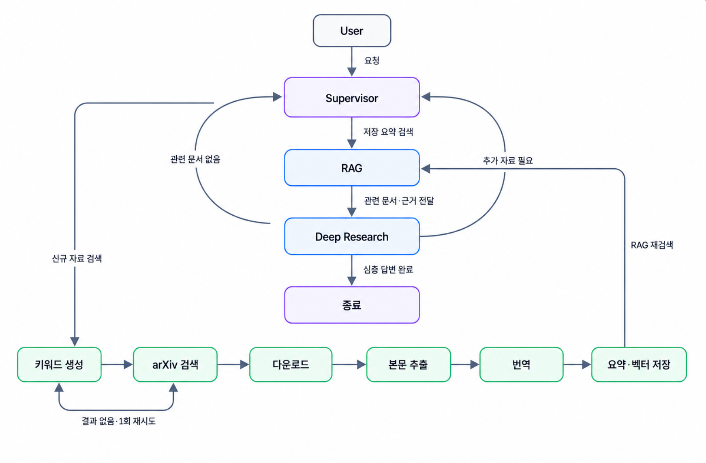
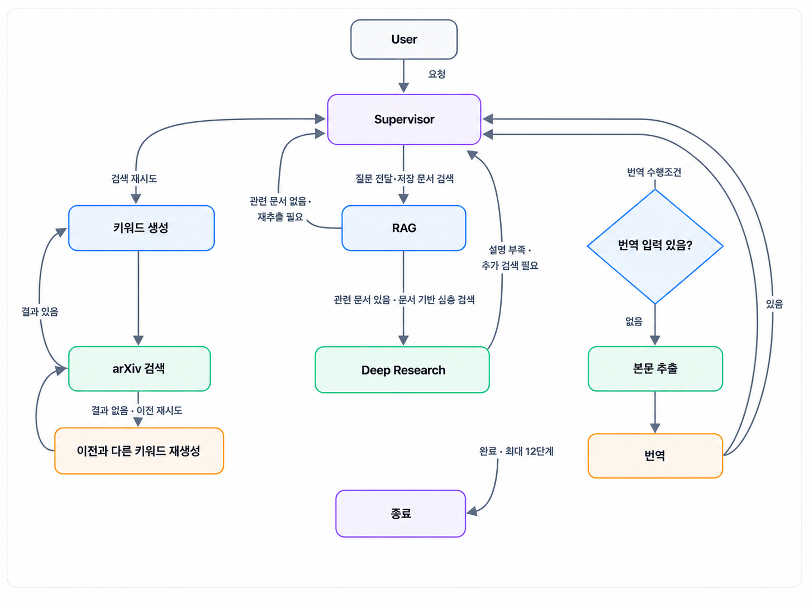
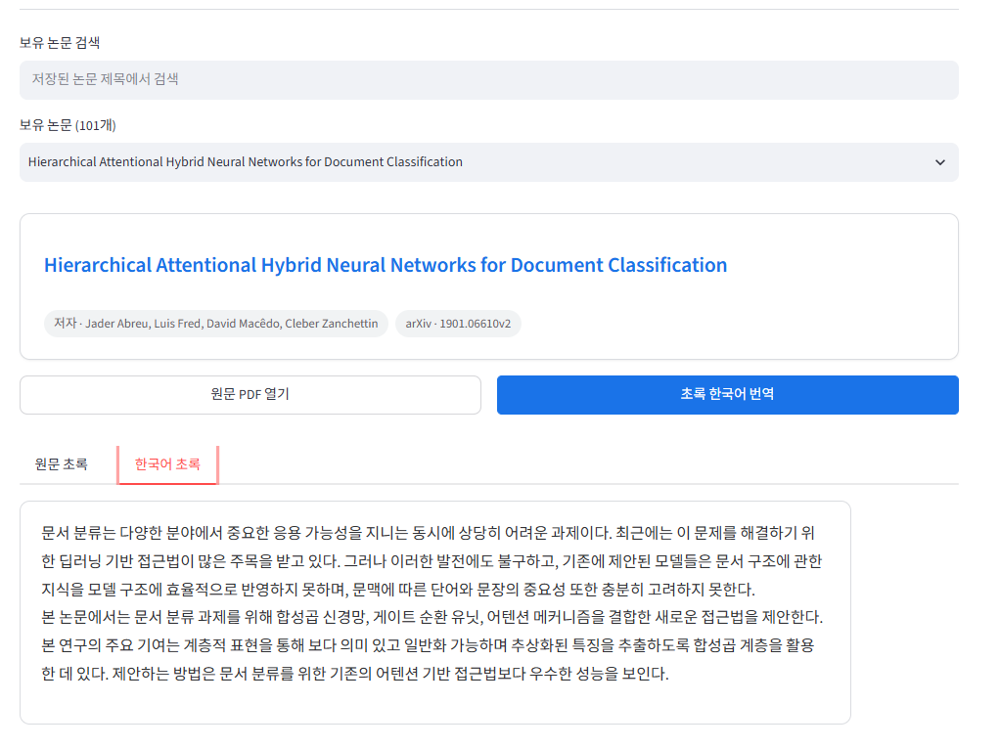
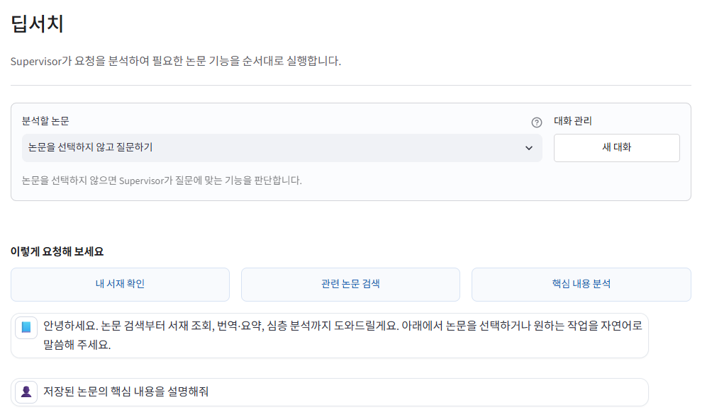
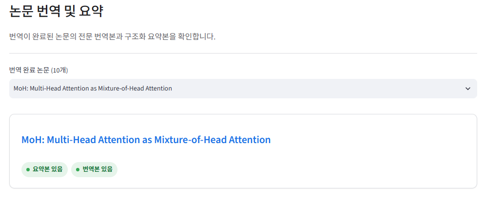

# Project-Team-2 / Academic Paper RAG Chatbot

arXiv와 PDF 학술 논문을 수집·파싱·인덱싱하여 논문 검색, 번역, 요약 및 근거 기반 심층 질의응답을 제공하는 RAG(Retrieval-Augmented Generation) 챗봇 프로젝트입니다.

## 목차

- [팀원 및 역할](#팀원-및-역할)
- [프로젝트 목표](#프로젝트-목표)
- [주요 기능](#주요-기능)
- [시스템 흐름](#시스템-흐름)
- [기술 스택](#기술-스택)
- [프로젝트 구조](#프로젝트-구조)
- [아키텍처와 LangGraph](#아키텍처와-langgraph)
- [스크린샷](#스크린샷)
- [실행 방법](#실행-방법)
  - [1. 환경변수 설정](#1-환경변수-설정)
  - [2. Ollama 설치 및 실행](#2-ollama-설치-및-실행)
  - [3. 프로젝트용 Ollama 모델 다운로드](#3-프로젝트용-ollama-모델-다운로드)
  - [4. Ollama 실행 확인](#4-ollama-실행-확인)
  - [5. Supervisor 챗봇 실행 (CLI)](#5-supervisor-챗봇-실행-cli)
  - [6. Streamlit 웹 앱 실행](#6-streamlit-웹-앱-실행)
  - [7. 평가(Evaluation) 실행](#7-평가evaluation-실행)
- [Git & GitHub 협업 규칙](#git--github-협업-규칙)
  - [권장 작업 흐름](#권장-작업-흐름)
  - [1. 브랜치 규칙](#1-브랜치-규칙)
  - [2. 커밋 메시지 규칙](#2-커밋-메시지-규칙)
  - [3. Pull Request 및 병합 규칙](#3-pull-request-및-병합-규칙)
  - [4. 프로젝트 구조 및 데이터 관리](#4-프로젝트-구조-및-데이터-관리)
- [절대 금지 사항 (Don'ts)](#절대-금지-사항-donts)
- [사용 패키지](#사용-패키지)
- [데이터 출처](#데이터-출처)
- [AI 에이전트 작업 제약 사항](#ai-에이전트-작업-제약-사항)
- [알려진 제약 사항 (Known Limitations)](#알려진-제약-사항-known-limitations)
- [향후 개선 사항](#향후-개선-사항)
- [회고](#회고)

## 팀원 및 역할

| 팀원 | 담당 역할 | 주요 담당 기능 |
| --- | --- | --- |
| 박기현 | 팀장·통합 | 일정 관리, 기능 통합, LangGraph |
| 오호민 | PM·논문 검색 | arXiv 검색, 논문 저장, PDF 다운로드 |
| 김영석 | PDF 처리 | PDF 본문·표·수식 추출 및 정제 |
| 정현두 | 번역·요약 | 전문 번역, 4단 구조 요약, ChromaDB |
| 김성환 | RAG 질의응답 | Retriever, Deep Research, 출처 반환 |

## 프로젝트 목표

- **비용 최소화:** 상시 GPU 서버 대신 로컬 Ollama·CPU 임베딩과 NVIDIA Build API 및 OpenAI API를 조합하여 고정 인프라 비용을 최소화합니다.
- **선택적 논문 처리:** 검색 결과의 초록을 먼저 확인한 뒤 사용자가 선택한 논문만 다운로드하고 인덱싱합니다.
- **신뢰도 높은 답변:** 검색 결과와 논문 본문을 근거로 답변하여 환각을 줄입니다.
- **단계별 사용자 개입:** 번역과 요약 이후 사용자가 원하는 후속 분석을 선택할 수 있도록 Human-in-the-Loop 흐름을 적용합니다.
- **기능별 에이전트 분리:** LangGraph 기반 Supervisor 에이전트가 검색, 수집, 번역, 요약, RAG 질의응답 및 Deep Research를 나누어 처리합니다.

## 주요 기능

1. 사용자 의도와 검색 조건 확인 후 arXiv API로 논문 메타데이터·초록 검색
2. 사용자가 선택한 논문만 다운로드 및 하이브리드(로컬 파싱 + NVIDIA Vision) PDF 파싱
3. 텍스트 정제, 청킹, 임베딩 및 ChromaDB 저장
4. 학술 논문 전문 번역(NVIDIA Build API)과 4단 구조 요약
5. 저장된 요약 기반 RAG 질의응답 및 근거·출처 제시
6. RAG가 찾은 논문을 이어받아 심층 분석하는 Deep Research
7. CLI(`main.py`)와 Streamlit 웹 앱(`web_app.py`) 두 가지 인터페이스 제공

## 시스템 흐름

```text
사용자 질의
↓
Supervisor가 의도 파악 및 다음 단계 계획 수립
↓
arXiv 검색 / 로컬 서재 조회 / 다운로드
↓
PDF 본문 추출 (로컬 파싱 + NVIDIA Vision 보정)
↓
전문 번역(NVIDIA Build API) → 4단 구조 요약 → ChromaDB 저장
↓
저장된 요약 기반 RAG 질의응답
↓
RAG가 찾은 논문을 넘겨받아 Deep Research로 심층 분석
```

자세한 노드 구성과 분기 조건은 아래 [아키텍처와 LangGraph](#아키텍처와-langgraph) 섹션을 참고합니다.

## 기술 스택

| 구분 | 기술 |
| --- | --- |
| Language | Python |
| Agent Workflow | LangGraph |
| Web UI | Streamlit |
| Paper Search | arXiv API |
| PDF Parsing | PyMuPDF, NVIDIA Build API (Vision) |
| Translation | NVIDIA Build API (`nemotron-3-nano-omni`) |
| Keyword / Summary LLM | Ollama (`qwen2.5:3b`) |
| Embedding | Hugging Face `BAAI/bge-m3` |
| Vector DB | ChromaDB |
| Evaluation | 400건 평가 코퍼스 v3, LangSmith, RAGAS·DeepEval·Promptfoo 어댑터 |
| Architecture | RAG, Human-in-the-Loop, Multi-Agent |

> 기술 스택은 구현 및 검증 과정에서 변경될 수 있습니다.

## 프로젝트 구조

```text
AcademicPaper_RAG_Chatbot/
├── .env.sample                     # 환경변수 예시 파일
├── .gitignore
├── figures/                         # README용 시스템 흐름도 및 Streamlit 화면 이미지
├── main.py                         # Supervisor 기반 LangGraph 챗봇의 CLI 진입점
├── web_app.py                      # Streamlit 웹 애플리케이션 진입점
├── requirements.txt                # 기본 Python 의존성 (평가 전용은 evaluation/requirements.txt)
├── apps/                           # 챗봇 대화·검색·논문 목록·번역/요약·Deep Research 화면
│   ├── __init__.py
│   ├── ui.py
│   ├── chatbot_app.py              # Supervisor 챗봇 대화 화면
│   ├── search_app.py               # arXiv 논문 검색 화면
│   ├── paper_list_app.py           # 저장된 논문 목록 화면
│   ├── translation_summary_app.py  # 번역·요약 화면
│   └── deep_search_app.py          # Deep Research 화면
├── data/                           # 논문 메타데이터, 본문 추출 결과, 번역·요약·벡터 DB 저장 위치
│   ├── paper_extract/
│   ├── paper_list/
│   ├── paper_save/
│   ├── translations/
│   └── vector_db/
├── evaluation/                     # LangSmith·RAGAS·DeepEval·Promptfoo 평가 스크립트와 설정
│   ├── README.md                   # 평가 실행 방법 안내
│   ├── DELIVERABLE_HANDOFF.txt     # 평가 산출물 인수인계 및 제출 지침
│   ├── dataset.py
│   ├── dataset_v3.py
│   ├── framework_cases.py
│   ├── quality_metrics.py
│   ├── run_evaluation.py
│   ├── run_v3_evaluation.py
│   ├── v3_runtime.py
│   ├── ragas_evaluation.py
│   ├── deepeval_evaluation.py
│   ├── promptfoo/
│   │   ├── promptfooconfig.yaml
│   │   ├── provider.py
│   │   ├── assertions.py
│   │   └── tests.py
│   ├── build_evaluation_corpus.py
│   ├── evaluate_langsmith.py
│   ├── evaluate_rag_langsmith.py
│   ├── corpus_v3/                   # 운영 DB와 분리된 평가 전용 코퍼스
│   │   ├── README.md
│   │   ├── build_corpus.py
│   │   ├── manifest.jsonl           # 평가 논문 40편
│   │   ├── dataset_v3.jsonl         # 후보 문항 650건
│   │   └── generated/
│   │       └── evaluation_summary_v3.json
│   └── requirements.txt            # RAGAS/DeepEval 등 평가 전용 의존성
├── log/                            # 공통 로거, 로그 코드와 메시지
│   ├── __init__.py
│   ├── app_logger.py
│   ├── log_codes.py
│   └── log_messages.py
├── src/
│   ├── config/
│   │   └── model_config.yaml       # 기능별 모델·Provider 설정 (API 키는 .env로 관리)
│   ├── feature/                    # 논문 검색·추출·Deep Research·Supervisor 챗봇 기능
│   │   ├── supervisor_chatbot.py
│   │   ├── search.py
│   │   ├── search_list.py
│   │   ├── paper_extractor.py
│   │   └── deep_research.py
│   ├── orchestration/              # LangGraph 상태·라우팅·그래프 구성·평가 로직
│   │   ├── __init__.py
│   │   ├── state.py
│   │   ├── routing.py
│   │   ├── graph.py
│   │   ├── adapters.py
│   │   └── evaluation.py
│   ├── services/                   # 모델 호출, 체크포인트, Markdown·Vector DB 저장
│   │   ├── __init__.py
│   │   ├── generation_options.py
│   │   ├── model_config_service.py
│   │   ├── nvidia_service.py
│   │   ├── ollama_service.py
│   │   ├── translation_service.py
│   │   ├── translation_checkpoint_service.py
│   │   ├── translation_markdown_service.py
│   │   ├── summary_checkpoint_service.py
│   │   ├── summary_markdown_store.py
│   │   ├── summary_vector_store.py
│   │   └── fulltext_vector_store.py
│   └── tools/                      # 키워드 생성, 번역, 요약, Deep Research 도구
│       ├── __init__.py
│       ├── keyword_tool.py
│       ├── translation_tool.py
│       ├── summary_tool.py
│       └── deep_search_tool.py
└── tests/                          # 기능·오케스트레이션 자동화 테스트
    ├── __init__.py
    ├── test_keyword_tool.py
    ├── test_translation_tool.py
    ├── test_translation_markdown_service.py
    ├── test_summary_tool.py
    ├── test_paper_extractor.py
    ├── test_deep_research.py
    ├── test_orchestration.py
    ├── test_quality_evaluation.py
    └── test_evaluation_frameworks.py
```

### 데이터 제출물 배치

대용량 논문 데이터는 소프트웨어 코드와 분리하여 제출합니다. `2팀_수집_및_전처리_데이터.zip`을 압축 해제한 뒤 다음 경로에 배치합니다.

| 데이터 제출물 폴더 | 프로젝트 경로 |
| --- | --- |
| `01_수집_검색결과/` | `data/paper_list/` |
| `02_수집_원문PDF/` | `data/paper_save/` |
| `03_전처리_본문추출/` | `data/paper_extract/` |
| `04_전처리_번역/` | `data/translations/` |
| `05_전처리_요약/` | `data/summaries/` |
| `06_임베딩_벡터DB/` | `data/vector_db/` |

평가용 코퍼스는 운영 데이터와 분리되어 `evaluation/corpus_v3/`에서 관리합니다.

## 아키텍처와 LangGraph

Supervisor 노드가 매 턴 사용자 요청을 해석해 다음에 실행할 노드를 결정하고, 각 실행 노드는 결과를 다시 Supervisor에 돌려줘 다음 단계를 재판단하는 순환 그래프(StateGraph) 구조입니다.

### 전체 처리 흐름



### LangGraph 세부 흐름



### 핵심 분기 규칙

- **신규 자료 검색:** Supervisor → `키워드 생성` → `arXiv 검색` → `다운로드` → `본문 추출` → `번역` → `요약·벡터 저장` → Supervisor로 복귀
- **검색 결과 없음:** `arXiv 검색` 결과가 비어 있으면 이전과 다른 키워드로 최대 1회 재생성·재시도 후, 그래도 없으면 종료
- **RAG 질의응답:** Supervisor → `RAG`가 저장된 요약에서 관련 문서를 조회
  - 관련 문서를 찾으면 그 문서를 들고 `Deep Research`로 전달해 심층 분석
  - 관련 문서가 없으면 Supervisor가 검색·다운로드·추출·번역·요약을 다시 거쳐 `RAG`를 재실행
- **Deep Research:** 심층 답변이 충분하면 종료, 설명이 부족하면 Supervisor에게 추가 검색을 요청
- **번역:** 이미 추출된 본문이 있으면 바로 번역, 없으면 먼저 본문 추출부터 수행
- **종료 조건:** 한 턴에 최대 12단계까지만 진행하며, 초과 시 오류로 종료

## 스크린샷

### 저장된 논문 목록 · 초록 한국어 번역



### arXiv 논문 검색 및 요약


### 저장된 논문 상세 보기(Deep Research)



### 논문 번역·요약 결과



## 실행 방법

### 1. 환경변수 설정

저장소를 내려받은 뒤 `.env.sample` 파일을 복사하여 `.env` 파일을 생성합니다.

실행 전 Python 3.11 이상 환경에서 기본 의존성을 설치합니다.

#### macOS / Linux

```bash
python3 -m venv .venv
source .venv/bin/activate
python -m pip install --upgrade pip
pip install -r requirements.txt
```

#### Windows PowerShell

```powershell
python -m venv .venv
.venv\Scripts\Activate.ps1
python -m pip install --upgrade pip
pip install -r requirements.txt
```

#### macOS / Linux

```bash
cp .env.sample .env
```

#### Windows PowerShell

```powershell
Copy-Item .env.sample .env
```

`.env.sample` 파일에는 OpenAI, NVIDIA 및 LangSmith 연결에 필요한 환경변수 이름이 정의되어 있습니다. 각 값을 본인의 키로 변경합니다.

```dotenv
OPENAI_API_KEY=your_openai_api_key
NVIDIA_API_KEY=your_nvidia_build_key
LANGSMITH_API_KEY=your_langsmith_api_key
```

Ollama 서버 주소와 기능별 모델은 `src/config/model_config.yaml`에서 관리합니다.

> 실제 API 키, 비밀번호 등 민감한 정보는 `.env.sample`이나 소스코드에 작성하지 않습니다.

### 2. Ollama 설치 및 실행

Ollama는 기본적으로 `http://localhost:11434`에서 실행됩니다. 운영체제에 맞는 터미널에서 아래 명령어를 실행합니다.

#### macOS

Terminal에서 공식 설치 스크립트를 실행합니다.

```bash
curl -fsSL https://ollama.com/install.sh | sh
```

설치 후 Ollama 앱이 실행되지 않았다면 다음 명령어로 실행합니다.

```bash
open -a Ollama
```

GUI 앱을 사용하지 않고 현재 Terminal에서 직접 서버를 실행하려면 다음 명령어를 사용합니다.

```bash
ollama serve
```

> `open -a Ollama`로 앱이 이미 실행 중이면 `ollama serve`를 다시 실행할 필요가 없습니다.

#### Windows

PowerShell에서 공식 설치 스크립트를 실행합니다.

```powershell
irm https://ollama.com/install.ps1 | iex
```

설치가 완료되면 PowerShell을 닫았다가 다시 실행합니다. Ollama는 일반적으로 백그라운드에서 자동 실행됩니다. 실행되지 않았다면 시작 메뉴에서 **Ollama**를 실행하거나 PowerShell에서 다음 명령어를 실행합니다.

```powershell
ollama serve
```

> Ollama가 이미 백그라운드에서 실행 중이면 `ollama serve`를 다시 실행할 필요가 없습니다.

자세한 설치 안내는 [Ollama macOS 공식 문서](https://docs.ollama.com/macos)와 [Ollama Windows 공식 문서](https://docs.ollama.com/windows)를 참고합니다.

### 3. 프로젝트용 Ollama 모델 다운로드

번역은 NVIDIA Build API로 처리하고, 로컬 Ollama는 다음 한 모델만 사용합니다.

| 기능 | 모델 |
| --- | --- |
| arXiv 검색 키워드 생성 | `qwen2.5:3b` |
| 논문 요약 | `qwen2.5:3b` |

```bash
ollama pull qwen2.5:3b
```

모델 이름은 [`src/config/model_config.yaml`](src/config/model_config.yaml)의 설정과 동일해야 합니다.

### 4. Ollama 실행 확인

설치된 모델 목록을 확인합니다.

```bash
ollama list
```

목록에 `qwen2.5:3b`가 표시되어야 합니다.

모델 응답을 직접 확인합니다.

```bash
ollama run qwen2.5:3b "retrieval augmented generation 검색 키워드를 만들어줘"
```

Ollama API 서버의 실행 상태를 확인합니다.

#### macOS

```bash
curl http://localhost:11434/api/tags
```

#### Windows PowerShell

```powershell
Invoke-RestMethod http://localhost:11434/api/tags
```

모델 목록이 JSON 형태로 반환되면 프로젝트에서 Ollama를 사용할 준비가 완료된 것입니다.

### 5. Supervisor 챗봇 실행 (CLI)

프로젝트 루트에서 다음 명령어를 실행합니다. 질문을 입력하면 계속 대화가 이어지고, `q`(또는 `종료`/`exit`/`quit`)를 입력하면 종료됩니다.

#### macOS

```bash
python3 main.py
```

#### Windows PowerShell

```powershell
python main.py
```

> 실행 전에 `requirements.txt` 의존성 설치와 `.env` 설정을 완료해야 합니다.

Ollama 설치 관련 세부 사항은 [macOS 공식 문서](https://docs.ollama.com/macos)와 [Windows 공식 문서](https://docs.ollama.com/windows)를 참고합니다.

### 6. Streamlit 웹 앱 실행

CLI 대신 웹 화면으로 사용하려면 프로젝트 루트에서 다음 명령어를 실행합니다. macOS·Windows 모두 동일합니다.

```bash
streamlit run web_app.py
```

브라우저가 자동으로 열리지 않으면 터미널에 표시된 `Local URL`(기본값 `http://localhost:8501`)로 직접 접속합니다.

`web_app.py`는 사이드바 메뉴와 화면 전환만 담당하며, 실제 기능 화면은 `apps/` 폴더에 모듈로 나뉘어 있습니다.

| 화면 | 파일 |
| --- | --- |
| Supervisor 챗봇 대화 | `apps/chatbot_app.py` |
| arXiv 논문 검색 | `apps/search_app.py` |
| 저장된 논문 목록 | `apps/paper_list_app.py` |
| 번역·요약 | `apps/translation_summary_app.py` |
| Deep Research | `apps/deep_search_app.py` |

> 실행 전에 CLI와 동일하게 `.env` 설정과 Ollama 서버 실행이 완료되어 있어야 합니다.

### 7. 평가(Evaluation) 실행

평가 전용 코퍼스와 실행 방법은 [`evaluation/README.md`](evaluation/README.md)에 정리되어 있습니다. 평가 코드는 운영용 `data/`와 분리된 `evaluation/corpus_v3/`를 사용합니다.

#### 평가 구성

후보 문항은 총 650건이며, 실제 실행 예산은 400건으로 고정했습니다.

| 평가 Suite | 후보 문항 | 실제 실행 |
| --- | ---: | ---: |
| Artifacts | 40 | 40 |
| Retrieval | 400 | 240 |
| Deep Research | 80 | 40 |
| Pipeline | 80 | 40 |
| Refusal | 50 | 40 |
| 합계 | 650 | 400 |

모든 논문이 평가 표본에 균형 있게 포함되도록 실행 케이스를 구성했습니다.

#### 400건 평가 결과

| 평가 항목 | 결과 | 해석 |
| --- | ---: | --- |
| 실행 건수 | 400건 | 고정 평가 예산 |
| 오류 건수 | 0건 | 평가 실행 오류 없음 |
| 논문 추출 제목 정확도 | 1.0000 | 추출 제목 보존 |
| 추출 내용 완전성 | 1.0000 | 본문 필수 내용 보존 |
| 논문 단위 검색 Recall@K | 1.0000 | 정답 논문 ID가 고정된 조건 |
| 논문 단위 MRR | 1.0000 | 정답 논문 순위 |
| Passage Section Recall@5 | 0.4042 | 본문 구간 검색 성능 |
| Passage Section MRR | 0.3979 | 정답 본문 구간의 순위 |
| 인용 정밀도 | 0.0000 | 명시적 출처 표기 부족 |
| 거절 정확도 | 0.7000 | 범위 밖 질문의 안전한 거절 |
| 필수 용어 재현율 | 0.5000 | Deep Research 핵심 용어 보존 |
| LangGraph 경로 정확도 | 1.0000 | 예상 경로와 실제 경로 일치 |
| Deep Research 완료율 | 1.0000 | 작업 완료 여부 |
| Pipeline 완료율 | 1.0000 | 전체 파이프라인 완료 여부 |

> 논문 단위 Recall@K와 MRR 1.0은 평가 입력에 정답 논문 ID가 고정된 구조의 영향을 받습니다. 실제 검색 품질은 Passage Section Recall@5와 Passage Section MRR을 중심으로 해석해야 합니다.

> 인용 정밀도 0.0은 검색 자체가 실패했다는 뜻이 아니라, 답변에 `[S1]`과 같은 명시적 출처 표기가 충분하지 않았다는 의미입니다.

> Deep Research 완료율과 Pipeline 완료율은 실행 완료 여부를 나타내며 답변의 의미적 정확성을 보장하지 않습니다.

#### 평가 실행 명령

평가 코퍼스 생성:

```bash
python evaluation/corpus_v3/build_corpus.py
```

400건 평가 실행:

```bash
python -m evaluation.run_v3_evaluation \
  --suite all \
  --answer-mode openai \
  --budget 400
```

평가 결과는 `evaluation/corpus_v3/generated/evaluation_summary_v3.json`과 `execution_results_v3.jsonl`에 저장됩니다.

RAGAS·DeepEval·LLM-as-a-Judge는 별도 API 토큰이 필요합니다. LangSmith 실험은 캐시 결과 기반으로 등록할 수 있으며, API 키와 실행 결과 원본 JSONL은 GitHub에 커밋하지 않습니다.

---

# Git & GitHub 협업 규칙

## 권장 작업 흐름

> **최신 `main` 확인 → 브랜치 생성 → 작업 및 커밋 → `main` 동기화 및 충돌 해결 → Push → PR 생성 → 코드 리뷰 → Squash Merge → 브랜치 삭제**

## 1. 브랜치 규칙

- **브랜치 생성:** 항상 최신 `main` 브랜치에서 생성합니다.
- **네이밍 규칙:** `작업종류/이니셜/작업명`
  - 예시: `feat/JHD/arxiv-search`
  - 작업명은 영문 소문자와 하이픈(`-`)만 사용합니다.
- **작업 단위:** `1 브랜치 = 1 목적` 원칙을 지킵니다.
- **사후 관리:** Merge가 완료된 브랜치는 로컬과 원격에서 모두 삭제합니다.

## 2. 커밋 메시지 규칙

- **메시지 형식:** `[이니셜] 타입: 변경 내용`
  - 예시: `[JHD] feat: arXiv 논문 검색 기능 추가`
- **작성 원칙:**
  - 변경 내용을 구체적으로 명시하고 끝에는 마침표를 붙이지 않습니다.
  - `수정`, `작업` 등 의미가 모호한 단어만으로 작성하지 않습니다.
  - 전체 파일 추가(`git add .`) 대신 변경된 파일을 확인하여 선택적으로 추가하고 커밋합니다.

### 주요 타입(Type)

| 타입 | 설명 |
| --- | --- |
| `feat` | 새로운 기능 추가 |
| `fix` | 버그 및 오류 수정 |
| `docs` | 문서 변경 |
| `refactor` | 기능 변경 없는 코드 구조 개선 |
| `test` | 테스트 코드 추가 및 수정 |
| `chore` | 환경 설정, 패키지 및 기타 작업 |
| `style` | 화면 디자인(UI) 및 스타일 변경 |

## 3. Pull Request 및 병합 규칙

- **PR 대상:** 항상 `main` 브랜치를 대상으로 PR을 생성합니다.
- **사전 작업:** PR 생성 전에 원격 `main`의 최신 변경 사항을 작업 브랜치에 반영하고 충돌을 해결합니다.
- **PR 내용:** 작업 목적, 주요 변경 사항, 실행 방법 및 테스트 결과를 상세히 작성합니다.
- **미완성 작업:** 아직 완료되지 않은 작업은 Draft PR을 활용합니다.
- **Merge 조건:**
  - 최소 1명 이상의 팀원 리뷰와 승인이 필요합니다.
  - 본인의 PR을 직접 병합하는 Self-merge는 금지합니다.
- **Merge 방식:** `Squash and merge`로 통일합니다.

## 4. 프로젝트 구조 및 데이터 관리

### 디렉터리 구조

- 메인 파일(`README.md`, `.env` 등)을 제외한 코드는 `src/feature/`와 `src/tools/`에 집중하여 최소 구조를 유지합니다.
- 새로운 디렉터리가 필요하면 팀원과 먼저 논의한 후 추가합니다.

### 데이터 관리

- 원본 데이터는 수정하지 않고 원형을 보존합니다.
- 개인정보, 비밀키가 포함된 `.env`, 대용량 파일은 저장소에 커밋하지 않습니다.
- 외부 자료를 활용할 때는 출처와 라이선스를 `README.md`에 명시합니다.

### 환경 관리

- 패키지와 버전은 `requirements.txt` 등의 의존성 파일로 관리합니다.
- 의존성을 추가하거나 변경하면 관련 파일도 함께 갱신합니다.

---

## 절대 금지 사항 (Don'ts)

- `main` 브랜치에 직접 Commit 또는 Push하기
- `main` 브랜치나 공유 브랜치에 Force Push(`-f`)하기
- 다른 팀원의 브랜치에 직접 Commit 또는 Force Push하기
- 다른 팀원의 브랜치를 동의 없이 병합 대상으로 삼기
- 충돌 해결 과정에서 다른 팀원의 코드를 임의로 삭제하거나 동의 없이 수정하기

---

## 사용 패키지

필수 패키지 목록은 [`requirements.txt`](requirements.txt)를 확인합니다. 평가 프레임워크(RAGAS/DeepEval 등) 전용 의존성은 [`evaluation/requirements.txt`](evaluation/requirements.txt)에 별도로 관리합니다.

---

## 데이터 출처

- **논문 메타데이터·원문 PDF:** [arXiv API](https://arxiv.org/help/api) — arXiv의 Open Access 정책에 따라 이용하며, 논문 저작권은 각 원저자·arXiv에 있습니다.
- **임베딩 모델:** Hugging Face `BAAI/bge-m3`
- **LLM:**
  - OpenAI GPT 계열 (Supervisor 라우팅, RAGAS/DeepEval 평가용 judge 모델)
  - Ollama `qwen2.5:3b` (로컬, 검색 키워드 생성·요약)
  - NVIDIA Build API `nemotron-3-nano-omni-30b-a3b-reasoning` (PDF Vision 추출, 번역)
- **원본 데이터 보존 원칙:** 다운로드한 PDF와 추출된 본문은 원형을 수정하지 않고 `data/` 하위에 저장합니다 (Git 협업 규칙의 데이터 관리 항목 참고).

---

## AI 에이전트 작업 제약 사항

- **폴더 구조 변경 금지**: 디렉토리 생성·삭제·이동을 임의로 하지 않습니다. 새 디렉토리가 필요하면 작업을 멈추고 사용자에게 먼저 확인합니다.
- **명시되지 않은 파일 수정 금지**: 사용자가 직접 언급했거나 명시적으로 승인한 파일 외에는 절대 수정하지 않습니다.
  - 버그의 근본 원인이 다른 파일에 있다고 판단되더라도, 임의로 확장하지 않고 원인과 수정이 필요한 파일 목록을 먼저 사용자에게 보고한 뒤 승인을 받고 진행합니다.
  - 여러 파일에 걸친 수정이 필요하면 전체 대상 파일을 목록으로 제시하고 승인을 받습니다.
  - 승인은 해당 작업 범위에만 유효하며, 이후 다른 작업에 자동으로 적용되지 않습니다.
- **수정 제안 방식**: 폴더·파일을 마음대로 수정하지 않으며, 수정이 필요한 부분은 먼저 코드(변경 내용)와 그 이유를 보여주는 방식으로 제안합니다.
  - 사용자가 수정을 원할 경우, 변경 내용과 이유를 다시 한번 명시하고 최종 확인을 받습니다.
  - 사용자가 확인 후 수정을 요구할 때만 실제로 수정합니다.

---

## 알려진 제약 사항 (Known Limitations)

- 논문 단위 Recall@K와 MRR은 정답 논문 ID가 고정된 평가 구조의 영향을 받습니다.
- 400건 평가에서 Passage Section Recall@5는 `0.4042`, Passage Section MRR은 `0.3979`로 측정되어 본문 구간 검색 품질 개선이 필요합니다.
- 답변의 명시적 출처 표기가 부족하여 인용 정밀도가 `0.0000`으로 측정되었습니다.
- Deep Research 필수 용어 재현율은 `0.5000`으로, 핵심 용어와 근거를 더 안정적으로 보존할 필요가 있습니다.
- RAGAS Faithfulness, Answer Relevancy 및 LLM-as-a-Judge 평가는 API 토큰이 설정된 환경에서 별도로 실행해야 합니다.
- BM25·Hybrid Search·Reranker와의 비교 평가는 아직 수행하지 않았습니다.
- 응답 시간, P95 지연시간, 비용 및 메모리 사용량 비교는 후속 평가 대상입니다.
- FastAPI 백엔드는 아직 구축되지 않아 CLI(`main.py`)와 Streamlit(`web_app.py`)으로만 사용할 수 있습니다.
- 수식·표가 밀집된 PDF 구간에서는 번역이 실패할 수 있습니다. 이 경우 해당 논문만 건너뛰고 나머지 파이프라인은 계속 진행됩니다.
- 자연어로 "1번 논문"처럼 번호를 지정해 특정 논문을 선택하는 기능은 제한적으로만 동작합니다.
- 평가 후보 문항은 650건이며, 실제 실행 예산 400건을 기준으로 결과를 산출했습니다.
- 원본 PDF와 평가 실행 결과 JSONL은 용량 때문에 GitHub에 포함하지 않습니다.
- 로컬 Ollama(`qwen2.5:3b`) 기반 검색 키워드 생성은 요청 문장에 번역·요약 등 다른 지시가 섞여 있으면 관련 없는 키워드를 만들어낼 수 있습니다.

---

## 향후 개선 사항

- **경량 모델 적용을 통한 응답 속도 개선**: 작업별 특성에 적합한 모델을 적용하여 추론 시간과 운영 비용을 최적화합니다.
- **GUI 환경을 고려한 서비스 구조 개선**: 현재 파이프라인을 API 기반으로 모듈화하여 후속 GUI 프로젝트와 안정적으로 연동합니다.
- **챗봇 처리 병목 최소화**: 비동기·병렬 처리와 캐싱을 적용하여 검색, 추출, 번역·요약 과정의 대기 시간을 단축합니다.
- **로컬 DB의 온라인 DB 전환**: 현재 SQLite·ChromaDB(로컬 파일 기반)로 관리하는 논문 메타데이터·벡터 데이터를 온라인 DB(PostgreSQL, 관리형 Vector DB 등)로 이전하여 다중 사용자 접근과 GUI/FastAPI 연동 시 동시성·확장성을 확보합니다.

---

## 회고

### 박기현 (팀장, LangGraph)

- Supervisor 하나가 검색·다운로드·추출·번역·요약·RAG·Deep Research를 전부 조율하다 보니, 상태(State)를 턴마다 제대로 초기화하지 않으면 이전 턴의 결과가 다음 턴에 새어 들어가는 문제를 겪었다. 멀티턴 대화를 유지하면서도 턴 단위로 깨끗하게 리셋해야 하는 부분의 경계를 정확히 잡는 게 생각보다 까다로웠다.
- "논문 찾아서 번역하고 요약해서 설명해줘"처럼 한 문장에 여러 의도가 섞인 요청을 하나의 실행 계획으로 묶어내는 라우팅 로직을 여러 번 다듬었다. 처음엔 키워드 하나만 보고 조기에 판단해버려서 뒷부분 요청이 누락되는 경우가 많았는데, 복합 요청을 먼저 감지하고 전체 파이프라인을 계획하도록 바꾸고 나서 안정됐다.
- 팀 전체 일정 조율보다 통합 코드에 시간을 더 많이 썼다. 다음엔 기능별 인터페이스(입출력 형식)를 더 일찍 확정해서 통합 단계의 재작업을 줄이고 싶다.

### 오호민 (PM, 논문 검색)

- arXiv 검색 자체는 API가 안정적이라 어렵지 않았지만, LLM이 생성한 검색 키워드에 "최신", "논문", "분석" 같은 범용 단어가 섞이면 전혀 관계없는 논문이 검색되는 문제가 있었다. 키워드 품질이 검색 결과 품질을 그대로 좌우한다는 걸 체감했다.
- 검색 결과를 로컬 서재(DB)에 저장하는 시점을 놓치면, 뒤 단계(다운로드·추출)에서 논문을 다시 못 찾는 문제가 있었다. 검색-저장-다운로드가 하나의 흐름으로 이어지도록 순서를 맞추는 게 중요했다.
- PM으로서 각 기능별 담당자가 병렬로 작업하는 과정에서 일정과 인터페이스를 조율하는 게 예상보다 신경 쓸 게 많았다.

### 김영석 (PDF 처리)

- 로컬 파싱만으로는 수식·표가 포함된 페이지에서 정보 손실이 많아서, NVIDIA Vision API로 페이지 이미지를 다시 읽게 하는 하이브리드 방식을 적용했다. 페이지당 처리 속도와 복원 정확도 사이에서 어떤 모델·해상도를 쓸지 계속 실험해야 했다.
- 논문마다 레이아웃이 달라서 표·수식 경계를 일관되게 잡는 규칙을 만드는 데 시간이 많이 들었다. 예외 케이스를 하나씩 다루기보다 처음부터 좀 더 일반화된 규칙을 고민했으면 좋았을 것 같다.

### 정현두 (번역·요약)

- 로컬 모델(translategemma:4b)로 번역했을 때 속도가 너무 느리고(4천자 조각당 약 5분), 수식·표를 보호 토큰으로 감싸 번역을 맡겨도 모델이 토큰 경계를 건드려 버리는 경우가 있었다. NVIDIA Build API로 옮기면서 속도는 15배 가까이 개선됐지만, 그 원인을 찾아 재현하는 과정이 오래 걸렸다.
- 4단 구조 요약(목적·방법·결과·한계)을 만들 때, 모델이 스키마의 키는 채워도 값이 비어버리는 경우가 있어서 여러 모델 크기로 비교 실험을 해야 했다. 결과적으로 이미 키워드 생성에 쓰던 `qwen2.5:3b`가 크기 대비 가장 안정적이었다.
- 번역 하나가 실패하면 이미 끝난 다른 논문 번역까지 통째로 날아가는 구조였던 걸 뒤늦게 발견했다. 여러 논문을 한 번에 처리하는 배치 로직은 처음부터 "일부 실패해도 나머지는 살린다"는 전제로 설계했어야 했다.

### 김성환 (RAG 질의응답)

- RAG가 답을 찾았을 때 그 문서를 Deep Research로 넘겨 심층 분석까지 자연스럽게 이어지도록 만드는 부분이 가장 신경 쓰였다. 근거 문서가 없을 때 무한정 재시도하지 않도록 재시도 횟수와 종료 조건을 명확히 설계해야 했다.
- 출처(source)를 답변과 함께 정확히 반환하는 것이 중요하다는 점을 확인했다. 400건 평가에서 논문 단위 검색 지표와 본문 구간 검색 지표를 분리해 보니, 논문 단위 지표만으로는 실제 검색 품질을 충분히 설명할 수 없었다. 또한 인용 정밀도가 0.0으로 측정되어 답변에 명시적인 출처 표기를 강화해야 한다는 개선 과제를 확인했다.

### 팀 전체

- 검색→다운로드→추출→번역→요약→RAG→Deep Research로 이어지는 파이프라인을 각자 맡은 구간별로 개발했는데, 정작 전체를 이어 붙였을 때 한 구간의 출력 형식이 다음 구간이 기대하는 입력과 미묘하게 다른 경우가 여러 번 나왔다. 인터페이스(입출력 스키마)를 더 일찍, 더 명확하게 합의했으면 통합 단계가 훨씬 수월했을 것이다.
- 로컬 모델(Ollama)만으로는 속도·품질 한계가 뚜렷해서 NVIDIA Build API를 일부 단계에 도입했는데, 이 결정 하나로 번역 속도가 크게 개선됐다. 비용과 성능을 함께 고려한 모델 선택이 프로젝트 전체 품질에 미치는 영향이 크다는 걸 배웠다.
- LangSmith 기반 400건 평가와 RAGAS·DeepEval·Promptfoo 실행 어댑터를 함께 구성하면서, "그럴듯해 보이는 답변"과 "실제로 근거에 충실한 답변"은 다르다는 점을 확인했다. 다음 프로젝트에서는 평가 체계를 개발 초반부터 함께 구축하고 싶다.
