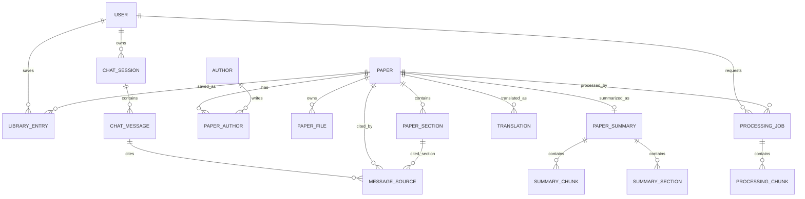

# Paper Scholar v2 기준 Django · MySQL 테이블 설계안

> 상태: 구현 전 예상 설계안  
> 기준 코드: `src/tools/summary_tool_v2.py`, `src/tools/translate_tool_v2.py`  
> 목적: 기존 SQLite·JSON·Markdown 저장 방식을 Django ORM과 MySQL 중심 구조로 전환

---

## 1. 먼저 이해할 핵심

현재 v2 코드의 처리 흐름은 다음과 같다.

```text
논문 검색
  ↓
논문 메타데이터 저장
  ↓
PDF 다운로드
  ↓
본문을 절(section) 단위로 추출
  ↓
summary_tool_v2가 본문을 요약
  ↓
translate_tool_v2가 생성된 요약문을 한국어로 번역
```

### 중요한 현재 동작

`translate_tool_v2.py`는 논문 전체 원문을 번역하는 코드가 아니다.

```text
summary.db의 요약문
  → translate_tool_v2
  → translate.db의 번역된 요약문
```

따라서 v2를 그대로 기준으로 구현하면 현재 번역 기능은 **요약문 번역**이다.  
향후 전체 논문 번역을 추가할 수 있도록 `translations.translation_type`으로 결과 종류를 구분한다.

---

## 2. 전체 테이블 관계



쉽게 표현하면 다음과 같다.

```text
사용자
 ├─ 내 서재
 ├─ 작업 요청
 └─ 채팅방

논문
 ├─ 저자
 ├─ PDF 파일 정보
 ├─ 추출된 본문 절
 ├─ 요약
 │   ├─ 절별 요약
 │   └─ 청크별 요약
 ├─ 번역
 └─ 처리 작업 기록
```

---

## 3. 1차 구현 대상 테이블

처음부터 모든 테이블을 만들기보다는 아래 테이블부터 구현한다.

| 순서 | 개념상 테이블 | Django 모델 | 역할 |
|---:|---|---|---|
| 1 | `papers` | `Paper` | 논문의 공통 기본 정보 |
| 2 | `authors` | `Author` | 저자 정보 |
| 3 | `paper_authors` | `PaperAuthor` | 논문과 저자의 다대다 연결 |
| 4 | `library_entries` | `LibraryEntry` | 사용자별 내 서재 |
| 5 | `paper_files` | `PaperFile` | PDF 등 실제 파일의 위치와 상태 |
| 6 | `paper_sections` | `PaperSection` | PDF에서 추출한 절별 본문 |
| 7 | `processing_jobs` | `ProcessingJob` | 추출·요약·번역 작업 상태 |
| 8 | `processing_chunks` | `ProcessingChunk` | 중간 저장 및 실패 작업 재개 |
| 9 | `paper_summaries` | `PaperSummary` | 논문 전체 요약 |
| 10 | `summary_sections` | `SummarySection` | 절별 요약 |
| 11 | `summary_chunks` | `SummaryChunk` | v2의 최종 청크 요약 |
| 12 | `translations` | `Translation` | v2 요약문 번역 결과 |

사용자 테이블은 직접 새로 만들지 않고 우선 Django 기본 인증 테이블을 사용한다.

```text
auth_user
```

> 실제 Django 테이블 이름에는 앱 이름이 붙을 수 있다. 예: `papers_paper`, `library_libraryentry`.  
> 이 문서에서는 이해하기 쉽도록 개념상 테이블 이름을 사용한다.

---

## 4. 테이블별 예상 구조

### 4.1 `papers` — 논문 기본 정보

모든 기능이 공통으로 참조하는 중심 테이블이다.

| 컬럼 | 예상 형식 | 설명 |
|---|---|---|
| `id` | BIGINT, PK | Django 내부 식별자 |
| `source` | VARCHAR(30) | `arxiv` 등 논문 출처 |
| `external_id` | VARCHAR(100), UNIQUE | `1702.01806v2` 같은 외부 논문 ID |
| `title` | TEXT | 논문 제목 |
| `abstract` | LONGTEXT | 초록 |
| `entry_url` | VARCHAR(500) | 논문 소개 페이지 URL |
| `pdf_url` | VARCHAR(500) | PDF 원본 URL |
| `published_at` | DATETIME, NULL | 최초 게시 시각 |
| `source_updated_at` | DATETIME, NULL | 원문 수정 시각 |
| `created_at` | DATETIME | DB 최초 등록 시각 |
| `updated_at` | DATETIME | DB 수정 시각 |

#### 제약 조건

```text
UNIQUE(source, external_id)
```

같은 arXiv 논문이 검색될 때마다 중복으로 생성되는 것을 방지한다.

#### 기존 데이터 대응

```text
data/paper_list/saved_papers.db의 papers
→ papers
```

---

### 4.2 `authors` — 저자

| 컬럼 | 예상 형식 | 설명 |
|---|---|---|
| `id` | BIGINT, PK | 저자 식별자 |
| `name` | VARCHAR(255) | 화면에 표시할 저자 이름 |
| `normalized_name` | VARCHAR(255), INDEX | 검색과 중복 비교용 이름 |
| `created_at` | DATETIME | 생성 시각 |

현재 SQLite에서는 저자 전체를 문자열 하나로 저장하지만, MySQL에서는 저자를 분리하여 저자별 검색이 가능하게 한다.

---

### 4.3 `paper_authors` — 논문과 저자 연결

한 논문에는 여러 저자가 있고, 한 저자는 여러 논문을 작성할 수 있기 때문에 연결 테이블이 필요하다.

| 컬럼 | 예상 형식 | 설명 |
|---|---|---|
| `id` | BIGINT, PK | 연결 식별자 |
| `paper_id` | FK → `papers` | 논문 |
| `author_id` | FK → `authors` | 저자 |
| `author_order` | INT | 논문에 표시되는 저자 순서 |

#### 제약 조건

```text
UNIQUE(paper_id, author_id)
UNIQUE(paper_id, author_order)
```

---

### 4.4 `library_entries` — 사용자별 내 서재

`papers`는 시스템 전체의 논문 목록이고, `library_entries`는 사용자가 자신의 서재에 저장한 기록이다.

| 컬럼 | 예상 형식 | 설명 |
|---|---|---|
| `id` | BIGINT, PK | 서재 항목 식별자 |
| `user_id` | FK → `auth_user` | 저장한 사용자 |
| `paper_id` | FK → `papers` | 저장한 논문 |
| `memo` | TEXT, NULL | 사용자 메모 |
| `saved_at` | DATETIME | 서재 저장 시각 |

#### 제약 조건

```text
UNIQUE(user_id, paper_id)
```

같은 사용자의 서재에 같은 논문이 두 번 들어가지 않도록 한다.

---

### 4.5 `paper_files` — PDF 등 파일 정보

PDF 파일 자체를 MySQL에 넣지 않고, 파일은 디스크나 파일 스토리지에 저장한다. MySQL에는 파일의 위치와 상태만 저장한다.

| 컬럼 | 예상 형식 | 설명 |
|---|---|---|
| `id` | BIGINT, PK | 파일 식별자 |
| `paper_id` | FK → `papers` | 대상 논문 |
| `file_type` | VARCHAR(30) | `pdf`, `extracted_md` 등 |
| `storage_path` | VARCHAR(1000) | 실제 파일 경로 또는 스토리지 키 |
| `original_name` | VARCHAR(500) | 원래 파일명 |
| `file_size` | BIGINT, NULL | 파일 크기 |
| `checksum` | VARCHAR(128), NULL | 동일 파일 확인용 해시 |
| `status` | VARCHAR(30) | `pending`, `ready`, `failed` |
| `downloaded_at` | DATETIME, NULL | 다운로드 완료 시각 |
| `created_at` | DATETIME | 생성 시각 |

#### 기존 데이터 대응

```text
data/paper_save/*.pdf
data/paper_save/downloaded_pdfs.json
→ 실제 PDF는 유지하고 메타데이터만 paper_files로 이전
```

---

### 4.6 `paper_sections` — 추출된 논문 본문

v2 요약이 읽는 원본 데이터이다.

| 컬럼 | 예상 형식 | 설명 |
|---|---|---|
| `id` | BIGINT, PK | 본문 절 식별자 |
| `paper_id` | FK → `papers` | 대상 논문 |
| `section_order` | INT | 논문 내 절 순서 |
| `section_title` | VARCHAR(500), NULL | 절 제목 |
| `section_text` | LONGTEXT | 정제된 본문 |
| `section_html` | LONGTEXT, NULL | 표·수식 등을 포함한 HTML |
| `extracted_at` | DATETIME | 추출 완료 시각 |

#### 제약 조건

```text
UNIQUE(paper_id, section_order)
INDEX(paper_id, section_order)
```

#### 기존 데이터 대응

```text
data/paper_extract/extracted_papers.db의 paper_sections
→ paper_sections
```

---

### 4.7 `processing_jobs` — 기능 실행 상태

Supervisor가 요청한 다운로드·추출·요약·번역 작업의 상태를 기록한다.

| 컬럼 | 예상 형식 | 설명 |
|---|---|---|
| `id` | BIGINT, PK | 작업 식별자 |
| `user_id` | FK → `auth_user`, NULL | 요청 사용자 |
| `paper_id` | FK → `papers` | 대상 논문 |
| `job_type` | VARCHAR(30) | `download`, `extract`, `summarize`, `translate`, `index` |
| `status` | VARCHAR(30) | `pending`, `running`, `completed`, `failed`, `cancelled` |
| `progress_current` | INT | 완료된 작업 수 |
| `progress_total` | INT | 전체 작업 수 |
| `model_name` | VARCHAR(255), NULL | 사용한 AI 모델 |
| `options` | JSON | 실행 옵션 |
| `error_message` | LONGTEXT, NULL | 실패 이유 |
| `started_at` | DATETIME, NULL | 시작 시각 |
| `completed_at` | DATETIME, NULL | 종료 시각 |
| `created_at` | DATETIME | 요청 생성 시각 |

#### 필요한 이유

Agent가 DB 테이블을 직접 관리하는 것이 아니라 Service가 작업 상태를 기록하게 한다.

```text
Agent
→ Service 실행 요청
→ ProcessingJob 상태 변경
→ Repository
→ Django ORM
→ MySQL
```

---

### 4.8 `processing_chunks` — 중간 결과와 재시작 지점

긴 논문은 한 번에 처리하기 어려우므로 여러 청크로 나눈다. 작업이 중간에 실패해도 완료된 청크 이후부터 이어서 실행할 수 있게 한다.

| 컬럼 | 예상 형식 | 설명 |
|---|---|---|
| `id` | BIGINT, PK | 청크 식별자 |
| `job_id` | FK → `processing_jobs` | 소속 작업 |
| `chunk_index` | INT | 청크 순서 |
| `section_order` | INT, NULL | 원본 절 순서 |
| `source_text` | LONGTEXT | 입력 원문 |
| `result_text` | LONGTEXT, NULL | 중간 처리 결과 |
| `protected_items` | JSON | 수식·표 등 보호 항목 |
| `status` | VARCHAR(30) | `pending`, `completed`, `failed` |
| `error_message` | TEXT, NULL | 청크별 오류 |
| `updated_at` | DATETIME | 마지막 처리 시각 |

#### 제약 조건

```text
UNIQUE(job_id, chunk_index)
```

#### 기존 데이터 대응

```text
paper_summary_chunk_temp
data/temp_summary/*
data/temp_translation/*
→ processing_jobs + processing_chunks
```

기존 임시 테이블과 JSON/TXT 체크포인트를 하나의 공통 구조로 합친다.

---

### 4.9 `paper_summaries` — 논문 전체 요약

`summary_tool_v2.py`의 최종 요약 결과를 저장한다.

| 컬럼 | 예상 형식 | 설명 |
|---|---|---|
| `id` | BIGINT, PK | 요약 식별자 |
| `paper_id` | OneToOne/FK → `papers` | 대상 논문 |
| `job_id` | FK → `processing_jobs`, NULL | 생성 작업 |
| `summary_text` | LONGTEXT | 최종 전체 요약 |
| `model_name` | VARCHAR(255) | 사용 모델 |
| `section_count` | INT | 처리한 절 수 |
| `chunk_count` | INT | 처리한 청크 수 |
| `created_at` | DATETIME | 최초 생성 시각 |
| `updated_at` | DATETIME | 다시 생성한 시각 |

처음에는 v2와 동일하게 논문당 현재 요약 하나를 유지한다. 나중에 모델별 결과 이력이 필요해지면 `version`과 `is_current` 컬럼을 추가한다.

#### 기존 데이터 대응

```text
summary.db의 paper_summaries
→ paper_summaries
```

---

### 4.10 `summary_sections` — 절별 요약

| 컬럼 | 예상 형식 | 설명 |
|---|---|---|
| `id` | BIGINT, PK | 절별 요약 식별자 |
| `summary_id` | FK → `paper_summaries` | 전체 요약 |
| `section_order` | INT | 원본 절 순서 |
| `section_title` | VARCHAR(500) | 절 제목 |
| `summary_text` | LONGTEXT | 해당 절의 요약 |
| `chunk_count` | INT | 절에 포함된 청크 수 |
| `model_name` | VARCHAR(255) | 사용 모델 |
| `created_at` | DATETIME | 생성 시각 |

#### 제약 조건

```text
UNIQUE(summary_id, section_order)
```

#### 기존 데이터 대응

```text
summary.db의 paper_summary_sections
→ summary_sections
```

---

### 4.11 `summary_chunks` — 최종 청크별 요약

`processing_chunks`가 실행 중인 임시 상태라면, `summary_chunks`는 성공적으로 확정된 요약 결과이다.

| 컬럼 | 예상 형식 | 설명 |
|---|---|---|
| `id` | BIGINT, PK | 청크 요약 식별자 |
| `summary_id` | FK → `paper_summaries` | 전체 요약 |
| `section_order` | INT | 원본 절 순서 |
| `chunk_index` | INT | 절 안의 청크 순서 |
| `section_title` | VARCHAR(500) | 절 제목 |
| `source_text` | LONGTEXT | 요약에 사용한 원문 |
| `summary_text` | LONGTEXT | 청크 요약 결과 |
| `protected_items` | JSON | 보존한 수식·표 정보 |
| `model_name` | VARCHAR(255) | 사용 모델 |
| `created_at` | DATETIME | 생성 시각 |

#### 제약 조건

```text
UNIQUE(summary_id, section_order, chunk_index)
```

#### 기존 데이터 대응

```text
summary.db의 paper_summary_chunks
→ summary_chunks
```

---

### 4.12 `translations` — v2 번역 결과

현재 v2에서는 요약문 번역을 저장한다. 전체 논문 번역으로 확장할 가능성을 고려해 번역 종류를 함께 저장한다.

| 컬럼 | 예상 형식 | 설명 |
|---|---|---|
| `id` | BIGINT, PK | 번역 식별자 |
| `paper_id` | FK → `papers` | 대상 논문 |
| `summary_id` | FK → `paper_summaries`, NULL | 요약 번역일 때 원본 요약 |
| `job_id` | FK → `processing_jobs`, NULL | 생성 작업 |
| `translation_type` | VARCHAR(30) | 현재는 `summary`, 향후 `full_text` 가능 |
| `source_language` | VARCHAR(20) | 예: `en` |
| `target_language` | VARCHAR(20) | 예: `ko` |
| `source_text` | LONGTEXT | 번역 입력 원문 스냅샷 |
| `translated_text` | LONGTEXT | 번역 결과 |
| `chunk_count` | INT | 번역 청크 수 |
| `model_name` | VARCHAR(255) | 사용 모델 |
| `created_at` | DATETIME | 최초 생성 시각 |
| `updated_at` | DATETIME | 수정 시각 |

#### 제약 조건

```text
UNIQUE(paper_id, translation_type, target_language)
```

#### 기존 데이터 대응

```text
translate.db의 translations
→ translations

source_summary
→ source_text

translated_summary
→ translated_text

translation_type
→ "summary"
```

---

## 5. 2차 구현 대상: RAG 채팅 테이블

검색·서재·추출·요약·번역이 안정된 다음 구현한다.

### `chat_sessions`

| 컬럼 | 설명 |
|---|---|
| `id` | 대화방 식별자 |
| `user_id` | 대화 사용자 |
| `thread_id` | LangGraph 대화 식별자 |
| `title` | 대화방 제목 |
| `created_at`, `updated_at` | 생성·수정 시각 |

### `chat_messages`

| 컬럼 | 설명 |
|---|---|
| `id` | 메시지 식별자 |
| `session_id` | 소속 대화방 |
| `role` | `user`, `assistant`, `system` |
| `content` | 메시지 내용 |
| `metadata` | Agent 실행 정보와 부가 정보(JSON) |
| `created_at` | 생성 시각 |

### `message_sources`

| 컬럼 | 설명 |
|---|---|
| `id` | 출처 식별자 |
| `message_id` | 출처를 사용한 AI 답변 |
| `paper_id` | 인용 논문 |
| `paper_section_id` | 인용한 본문 절, 선택 사항 |
| `chunk_reference` | ChromaDB 청크 식별자 |
| `score` | 검색 유사도 점수 |
| `quoted_text` | 답변 근거로 사용한 짧은 본문 |

기존 `MemorySaver`는 실행 중 임시 대화 상태에 가깝다. Django UI에서 대화 기록을 다시 열려면 위 테이블이 필요하다.

---

## 6. ChromaDB와 MySQL의 역할 구분

ChromaDB의 벡터를 MySQL에 복사하지 않는다.

| 저장소 | 담당 데이터 |
|---|---|
| MySQL | 논문, 본문, 요약, 번역, 사용자, 작업 상태, 채팅 |
| ChromaDB | 임베딩 벡터와 유사도 검색용 문서 |
| 파일 스토리지 | PDF, 필요 시 Markdown 내보내기 파일 |

필요하면 `vector_index_states` 테이블을 추가한다.

```text
paper_id
collection_name
content_hash
chunk_count
embedding_model
indexed_at
status
```

이 테이블은 “MySQL의 최신 본문이 ChromaDB에 반영됐는가?”를 확인하는 용도이다.

---

## 7. 기존 저장 방식에서 MySQL로 옮기는 위치

| 현재 저장 위치 | 새 저장 위치 |
|---|---|
| `saved_papers.db / papers` | `papers`, `authors`, `paper_authors` |
| `saved_papers.json` | MySQL로 통합 후 운영 저장소에서는 제거 |
| `downloaded_pdfs.json` | `paper_files` |
| `extracted_papers.db / paper_sections` | `paper_sections` |
| `summary.db / paper_summaries` | `paper_summaries` |
| `summary.db / paper_summary_sections` | `summary_sections` |
| `summary.db / paper_summary_chunks` | `summary_chunks` |
| `summary.db / paper_summary_chunk_temp` | `processing_chunks` |
| `translate.db / translations` | `translations` |
| 요약·번역 체크포인트 파일 | `processing_jobs`, `processing_chunks` |
| 요약·번역 Markdown | DB 결과에서 필요할 때 내보내기 |
| LangGraph `MemorySaver` | 추후 `chat_sessions`, `chat_messages` |
| ChromaDB | 그대로 유지 |

---

## 8. v2 코드에서 바꿔야 할 부분

### 현재 구조

```text
summary_tool_v2
→ sqlite3.connect(summary.db)
→ SQL 직접 실행

translate_tool_v2
→ sqlite3.connect(summary.db / translate.db)
→ SQL 직접 실행
```

### 목표 구조

```text
Supervisor / Agent
→ Service
→ Repository
→ Django ORM
→ MySQL
```

### 기능별 변경 방향

#### `summary_tool_v2.py`

- `paper_sections`를 직접 SQLite로 조회하는 부분을 `PaperSectionRepository`로 이동
- `paper_summaries`, `paper_summary_sections`, `paper_summary_chunks` INSERT/UPDATE를 `SummaryRepository`로 이동
- 요약 생성과 프롬프트 로직은 Service에 유지
- 중간 체크포인트는 `ProcessingJob`, `ProcessingChunk`로 저장

#### `translate_tool_v2.py`

- `summary.db` 직접 조회를 `PaperSummaryRepository`로 교체
- `translate.db` 직접 저장을 `TranslationRepository`로 교체
- 번역 모델 호출과 Markdown 보호 로직은 Service에 유지

#### Supervisor 연결

Supervisor 어댑터는 v2 요약·번역 계약을 사용한다.

```python
from tools.translate_tool_v2 import TranslateTool
from agent.summary_agent import SummaryAgent
```

LangGraph는 v2 Agent의 입출력을 State 계약으로 변환하고, Django 웹은
동일한 v2 요약·번역 저장소를 사용한다.

```text
Supervisor
 ├─ SummaryAgent(v2 로직)
 └─ TranslateTool(v2 로직)
```

각 Agent는 독립적으로 호출되며, 번역 요청에서 요약 산출물이 없을 때만
Supervisor가 요약을 선행 의존성으로 보충한다.

---

## 9. 구현 순서

### 1단계 — Django 기반 준비

1. Python 가상환경 구성
2. Django와 MySQL 드라이버 설치
3. Django 프로젝트 설정
4. `.env`에 DB 접속 정보 저장
5. `settings.py`에서 MySQL 연결
6. `python manage.py check`로 연결 확인

### 2단계 — 핵심 모델

1. `Paper`, `Author`, `PaperAuthor`
2. `LibraryEntry`, `PaperFile`
3. `PaperSection`
4. `ProcessingJob`, `ProcessingChunk`
5. `PaperSummary`, `SummarySection`, `SummaryChunk`
6. `Translation`

### 3단계 — Migration

```bash
python manage.py makemigrations
python manage.py migrate
```

테이블은 PyCharm SQL 콘솔에서 직접 만들지 않고 Django migration으로 생성한다.

### 4단계 — v2 저장 코드 교체

1. Repository 작성
2. v2 요약 SQLite 조회·저장 제거
3. v2 번역 SQLite 조회·저장 제거
4. Supervisor를 v2 Service로 연결
5. 단위 테스트와 통합 테스트

### 5단계 — 기존 데이터 이전

1. SQLite 백업
2. 논문 메타데이터 이전
3. 본문 절 이전
4. 요약 결과 이전
5. 번역 결과 이전
6. 논문별 건수와 관계 검증

### 6단계 — 채팅 및 RAG 저장

1. `ChatSession`, `ChatMessage`, `MessageSource`
2. ChromaDB 인덱싱 상태 관리
3. Django UI/API와 Supervisor 연결

---

## 10. 삭제 규칙 예상

데이터가 의도치 않게 함께 삭제되지 않도록 관계별 정책을 구분한다.

| 관계 | 권장 정책 | 이유 |
|---|---|---|
| 사용자 → 서재 항목 | `CASCADE` | 사용자 삭제 시 개인 서재 기록 제거 |
| 논문 → 서재 항목 | `CASCADE` | 존재하지 않는 논문 참조 방지 |
| 논문 → 본문/파일/요약/번역 | `CASCADE` | 논문에 종속된 데이터 |
| 논문 → 작업 기록 | `CASCADE` 또는 보존 정책 결정 | 운영 로그 보존 여부에 따라 결정 |
| 요약 → 절/청크 요약 | `CASCADE` | 상위 요약이 없으면 의미 없음 |
| 채팅 메시지 → 출처 | `CASCADE` | 답변 삭제 시 출처도 삭제 |
| 논문 → 채팅 출처 | `PROTECT` 또는 `SET_NULL` | 과거 답변 기록 보존 고려 |

운영 중 논문을 실제로 삭제하기보다는 `is_active` 또는 `deleted_at`을 이용한 소프트 삭제도 고려한다.

---

## 11. 보안 및 협업 규칙

- Django는 `root` 계정을 사용하지 않는다.
- Django는 `paper_scholar_app` 계정을 사용한다.
- DB 비밀번호는 `.env`에만 저장한다.
- `.env`는 Git에 커밋하지 않는다.
- `.env.sample`에는 실제 비밀번호 대신 변수 형식만 작성한다.
- 팀원 모두 migration 파일은 공유하지만, 공용 DB에서 `migrate`를 실행할 담당자는 한 명으로 정한다.
- 공용 DB에서 migration이나 삭제 작업을 하기 전에 팀에 알린다.

예상 환경변수 이름은 다음과 같다.

```dotenv
DB_NAME=paper_scholar
DB_USER=paper_scholar_app
DB_PASSWORD=실제_값은_로컬_env에만_입력
DB_HOST=skn33.iptime.org
DB_PORT=33062
```

---

## 12. 현재 확정 사항과 추가 결정 사항

### 확정한 방향

- MySQL 스키마: `paper_scholar`
- Django 접속 계정: `paper_scholar_app`
- Django ORM과 migration으로 테이블 관리
- 번역·요약 기능은 v2 코드 기준
- PDF와 ChromaDB 벡터는 MySQL 외부에 보관
- Agent가 SQL을 직접 실행하지 않고 Service와 Repository를 통하여 저장

### 구현 전에 추가로 결정할 사항

1. v2 번역을 현재처럼 요약문 번역으로 유지할지
2. 전체 논문 번역을 함께 제공할지
3. 한 논문에 요약 결과를 하나만 유지할지, 생성 이력을 보관할지
4. PDF를 모든 개발자의 로컬에 둘지, 팀 공용 스토리지를 사용할지
5. 채팅 기록과 LangGraph 체크포인트를 어느 단계에서 영구 저장할지

현재 1차 구현은 **논문당 최신 요약 하나 + 요약문 번역 하나**를 기준으로 시작하고, 필요한 경우 이력 관리와 전체 논문 번역을 확장하는 것이 가장 단순하다.
